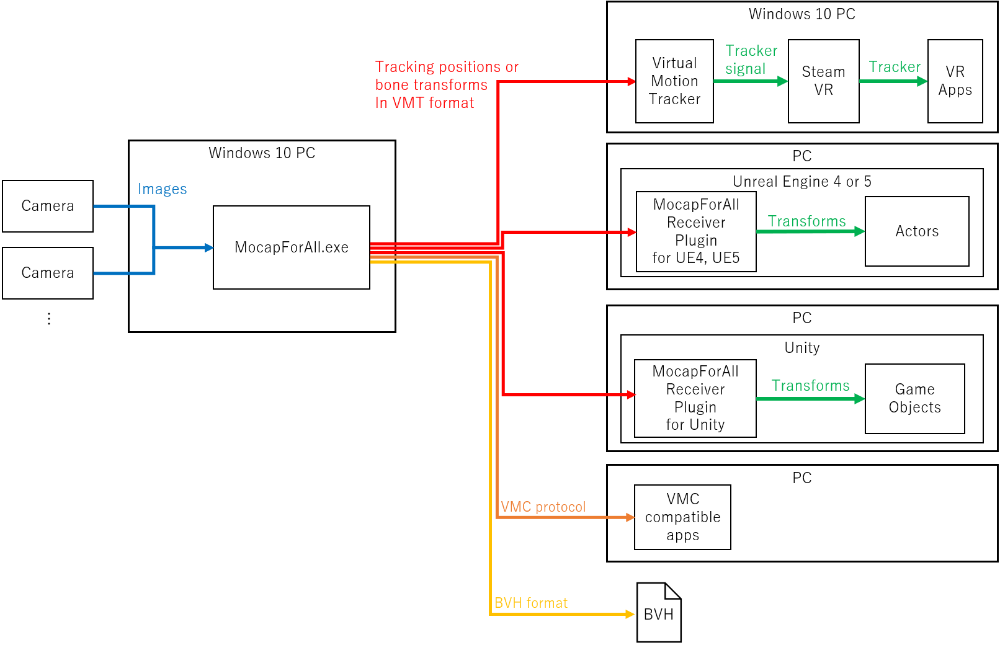
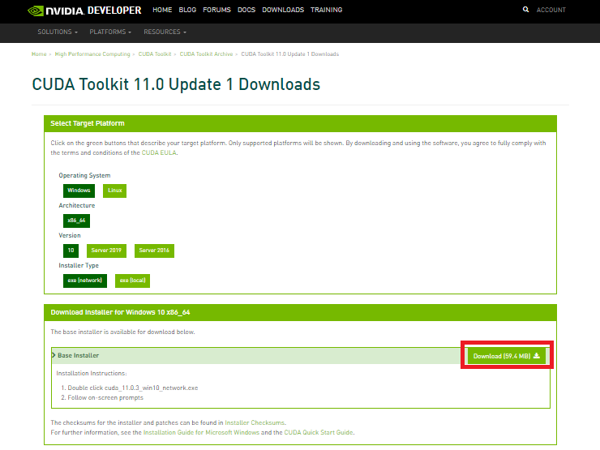
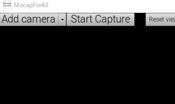

# Table of contents

- [What is MocapForAll?](#What-is-MocapForAll)

- [How to install MocapForAll](#How-to-install-MocapForAll)

- [How to use 1: Preparations to capture motion](#How-to-use-1-Preparations-to-capture-motion)
  - [Get cameras](#Get-cameras)
  - [Calibrate cameras](#Calibrate-cameras)
  - [Settings on the app](#Settings-on-the-app)
  
- [How to use 2: Export captured motion](#How-to-use-2-Export-captured-motion)
  - [Use in SteamVR via VMT](#Use-in-SteamVR-via-VMT)
  - [Use in other apps via VMC protocol](#Use-in-other-apps-via-VMC-protocol-1)
  - [Save as BVH files](#Save-as-BVH-files)
  - [Use in UE4, UE5, Unity](#Use-in-UE4-UE5-Unity)
  
- [How to use 3: Other settings](#How-to-use-3-Other-settings)

- [FAQ](#FAQ)

- [Known issues](#Known-issues)

- [Acknowledgements](Acknowledgements)

 

# What is MocapForAll?

## Motion capture software for everyone

### No special equipment required

You can capture human motion if you have the followings:

- a middle range PC
- 2 or more webcams
- a room of about 2.5m x 2.5m

You can use regular webcams like the ones used in video conferences. You can also use apps that turns your smartphones or tablets into webcams.

### Realtime with a middle range PC
For examples, it runs at 

- around 17 fps on Surface Pro 7 which does not have a dedicated GPU
- 30 to 60 fps on GTX 1080 Ti

### Cheap (JPY9999)
An option for projects with limited budgets, such as indie games, indie films, or education.
## What you can do with MocapForAll
You can output captured motion to the network via VMT protocol(\*1) and [VMC protocol](https://protocol.vmc.info/) in real time(\*2). Also, you can save the captured motion to files in BVH format.

> (\*1 The "VMT protocol" here refers to the [message format](https://gpsnmeajp.github.io/VirtualMotionTrackerDocument/api/#osc-protocol-osc) used in the communication of [Virtual Motion Tracker](https://gpsnmeajp.github.io/VirtualMotionTrackerDocument/). The official HP of Virtual Motion Tracker does not use the word "VMT protocol", but MocapForAll uses the word "VMT protocol" for convenience.)
>
> (\*2 Both VMT protocol and VMC protocol use UDP/OpenSound Control.)
>

By using these, you can do the followings, as well as  you can even create your own programs to receive data since the output specifications are open to public.

 

### Use in SteamVR via Virtual Motion Tracker
Through [Virtual Motion Tracker](https://gpsnmeajp.github.io/VirtualMotionTrackerDocument/), the capture motion can be used as virtual trackers in applications running on SteamVR.

### Use in UnrealEngine4, UnrealEngine5, Unity

You can send the captured motion to UnrealEngine4, UnrealEngine5, or Unity for game development or video production.  
Plugins for linking data directly to UE4, UE5, or Unity are available [here](https://booth.pm/ja/items/3026430).  
In addition, as described in [Use in other apps via VMC protocol](#Use-in-other-apps-via-VMC-protocol), it is also possible to link by EVMC4U and VMC4UE using VMC Protocol.

### Use in other apps via VMC protocol

You can send the captured motion to various applications via the VMC protocol. The following are confirmed to work:

- Sending tracker to [VirtualMotionCapture](https://vmc.info/)
- Sending bones to [VSeeFace](https://www.vseeface.icu/), and receiving facial expression morphs from VSeeFace
- Sending bones and facial expression morphs to [EVMC4U](https://github.com/gpsnmeajp/EasyVirtualMotionCaptureForUnity)
- Sending bones and facial expression morphs to [VMC4UE](https://github.com/HAL9HARUKU/VMC4UE)

### Export in BVH format

You can save the captured motion as BVH files. It can be used with Blender etc.

# How to install MocapForAll
## How to download
### Free trial version
Free trial version is available at BOOTH:  
https://akiya-souken.booth.pm/items/3026474

Before purchase, it is required to try free version and confirm that the software works without problems in your environment.   
In this free version, there are limitations on data export functions.  

- Data sending via VMT protocol and VMC protocol stops and restarts every 10 seconds
- Maximum frames in a BVH file is limited to 300

### Paid version
Before purchase, please read and accept the terms and conditions from the following link.  
If you agree, you can get your purchase password and proceed to the purchase page at BOOTH.  
https://vrlab.akiya-souken.co.jp/product#buy

You need a pixiv account to purchase at BOOTH.

## How to install
You can install MocapForAll [manually](#Manual-installation) or by using [network installer](#Installation-by-Network-Installer).  

### Manual installation

#### Main files
1. Download and unzip "MocapForAll_Full_vN.N.N.zip"
2. Execute MocapForAll.exe in "MocapForAll_Full_vN.N.N" folder
3. If the "UE4 Prerequisites" installation screen is displayed, install it.

#### Appendix (Optional)

 If you do not need the functions in Appendix, you can skip this step.  
There are four types of Appendix as follows:

- Appendix1：Precision mode  
  Adds "Precision" mode for precise motion capture. Since the CPU / GPU usage is very high, it is not recommended to use with VR apps at the same time.
- Appendix2：HDRI maps  
  Adds maps which use HDRI images from [HDRI Haven](https://hdrihaven.com).  
- Appendix3：MetaHuman character  
  Adds a character created by Epic games' MetaHuman Creator. Used to test motion capture on MocapForAll.
- Appendix4：TensorRT mode  
  Adds "GPU_TensorRT" mode which provides GPU acceleration on supported NVIDIA GPUs. As described below, CUDA, cuDNN, and TensorRT need to be installed. (In most cases, the standard "GPU_DirectML" mode will suffice.)

##### How to install Appendix
1. Download and unzip "AppendixN_xxxxx_yyyyy.zip".
2. Overwrite "MocapForAll_Full_vN.N.N\MocapForAll" with "AppendixN_xxxxx_yyyyy\MocapForAll".
3. If you install "Appendix4_TensorRT_mode", follow the steps below.

##### Installation of TensorRT

Details

This section is only for enthusiasts who want to improve performance even by 1ms/frame.  
（Using GTX1080Ti in our dev env, TensorRT has better performance than DirectML by 1ms/frame/camera in Precision mode, for example.)    

Requires an Nvidia GPU that supports CUDA, cuDNN, and TensorRT.    
Please note that the versions of cuDNN and TensorRT are different for RTX30** series and others as shown below (\*3).  

For the RTX30 ** series, we only tested RTX3060Ti and RTX3070. Others are not tested.

|              | Other than RTX30** series               | RTX30** series                             |
| ------------ | --------------------------------------- | ------------------------------------------ |
| **CUDA**     | 11.0.3                                  | 11.0.3                                     |
| **cuDNN**    | v8.0.2 (July 24th, 2020), for CUDA 11.0 | v8.0.5 (November 9th, 2020), for CUDA 11.0 |
| **TensorRT** | 7.1.3.4 for CUDA 11.0                   | 7.2.2.3 for CUDA 11.0                      |

> (\*3: The versions for RTX30** series were provided by [漆原 鎌足](https://twitter.com/kamatari_san/status/1435536643901902852) san. Thank you!)   

From now on, we will only explain the case of **other than RTX30\*\* series**. If you are using RTX30\*\* series, please read the versions as appropriate.

1. Install [CUDA 11.0.3](https://developer.nvidia.com/cuda-11.0-update1-download-archive?target_os=Windows&target_arch=x86_64&target_version=10&target_type=exenetwork)   
    Please note that the installer may fail to install the NVIDIA driver. In that case, please install the latest NVIDIA driver manually.    
      
2. Download and unzip [cuDNN v8.0.2 (July 24th, 2020), for CUDA 11.0](https://developer.nvidia.com/rdp/cudnn-archive)  
      
3. Overwrite the following folders  
    * C:\Program Files\NVIDIA GPU Computing Toolkit\CUDA\v11.0\bin
    * C:\Program Files\NVIDIA GPU Computing Toolkit\CUDA\v11.0\include
    * C:\Program Files\NVIDIA GPU Computing Toolkit\CUDA\v11.0\lib  
    
    with unzipped  
    
    * cudnn-11.0-windows-x64-v8.0.2.39\cuda\bin
    * cudnn-11.0-windows-x64-v8.0.2.39\cuda\include
    * cudnn-11.0-windows-x64-v8.0.2.39\cuda\lib  
    
4. Add an environment variable "CUDNN_PATH", and set its value to "C:\Program Files\NVIDIA GPU Computing Toolkit\CUDA\v11.0".  
5. Download and unzip [TensorRT7.1.3.4](https://developer.nvidia.com/nvidia-tensorrt-7x-download)
    Note that a Nvidia account is required.  
      

6. Add the path of lib folder in that to the environment variable "PATH", for example "C:\Program Files\NVIDIA GPU Computing Toolkit\TensorRT-7.1.3.4\lib"  

7. Add an environment variable "ORT_TENSORRT_ENGINE_CACHE_ENABLE" and set its value to "1".  

8. Add an environment variable "ORT_TENSORRT_CACHE_PATH" and set its value to any path where you want to save the cache files, for example "C:\temp".  

    （(For other options of TensorRT, see [this](https://www.onnxruntime.ai/docs/reference/execution-providers/TensorRT-ExecutionProvider.html#configuration-options)） 　
    （Your environment variables will be something like this）  

      
    

​    （Your environment variable "Path" will be something like this）  
    

### Installation by Network Installer
1. Download and unzip "Network_Installer_-_MocapForAll_Full_vN.N.N.zip".

2. Execute "Network_Installer_-_MocapForAll_Full_vN.N.N.exe".

3. Select the required Appendix. See [Appendix](#Appendix-optional) for the contents.

   To use "Appendix4_TensorRT_mode", see [Installation of TensorRT](#Installation-of-TensorRT) and install the required software.

4. Run MocapForAll from the Start menu or MocapForAll.exe in the installation path.

5. If the "UE4 Prerequisites" installation screen is displayed, install it.

## How to update

### Manual update

1. Download and unzip "MocapForAll_Full_vN.N.N.zip".
2. Overwrite the old version of "MocapForAll_Full_vM.M.M" with new "MocapForAll_Full_vN.N.N".

### Update by Network Installer

Same as installation.

If you wan to reduce the data size to download, select only "Main Files" in "Select Components" screen without selecting "Appendix" and execute installation.   
Since the installer does not delete files, the previous Appendix remains .  
After that, Appendix will be treated as not installed on the "Select Components" screen of the installer, but this cause no problem.

# How to use 1: Preparations to capture motion

## Get cameras
You need webcams that can be connected to the PC in which MocapForAll installed.  
To use smartphones or tablets, use apps that turns your smartphones or tablets into webcams, such as [DroidCam](https://www.dev47apps.com/) or [Iriun](https://iriun.com/).   

### What kind of camera should I use?
#### Webcams or smartphones
There is no quantitative data on which is more accurate when using a webcam or smartphone. It is best to actually plug and test your device.  
When using battery-powered equipment such as smartphones, be careful not to run out of battery.  
For your information, all official videos of MocapForAll are taken using wirelessly connected smartphone and tablet, except those that state  wired cameras are used.

#### Wired or wireless
The delay of motion capture by MocapForAll mainly consists of the time it takes for the camera image to be transferred to the PC.
Wired cameras often have less delay than wireless cameras. Also, keep in mind that delays tend to increase when using apps that turn smartphones into webcams or virtual cameras.
To use with VR devices, it is recommended to make the delay as small as possible.

#### FOV, frame rate, image size
- The wider the **FOV**, the wider the space for motion capture. However, MocapForAll calculates the 3D position with a simple pinhole camera model, so if the image is distorted like a fisheye lens, the movement cannot be captured correctly. A camera with low distortion and a wide FOV is most suitable. Some people use 120 degree FOV cameras, and it seems they work very well.  
- If the **frame rate** is low, that value can be a bottleneck in the frame rate of the capture. Considering the performance of your PC, get cameras with a higher frame rate than that of your desired capture result. The performance of MocapForAll itself is, using GTX1080Ti for example, about 60fps when MocapForAll is operated alone, and about 20fps when used with VR at the same time.   
- **Image size** does not contribute much to the precision of the capture of body movement. About 640x480 pixels is enough. This is due to the pipeline of the image processing: firstly the image is cropped around the person and then reduced to, for example, 256x256 pixel to input to the AI. However, when capturing hands and faces, the same processing is performed for small areas of hands and face, so the larger the image size (and resolution), the better the accuracy. We usually use cameras with image sizes around HD.

### Where should I put cameras?
Put cameras where they can see your whole body as well as the following conditions are satisfied:

#### Vertical position: chest to eye level
It is recommended to place the camera at the height between your chest and your eyes.  
If the camera is looking up or down too much, the accuracy tends to be poor. 

#### Horizontal position: 45° left and right from front
It is recommended to place the camera at 45 degree left and right from the front of the captured person.  
If the capture target and the two cameras are positioned in a straight line, the accuracy tend to be poor because the depth information is insufficient.  
This is an example of our camera placement:  

    

### Number of the cameras

By increasing the number of cameras, the occlusion is reduced, so it is expected to improve the accuracy. However, there is no quantitative data on this.    
Since the CPU / GPU usage increases almost in proportion to the number of cameras, increasing the number of cameras will reduce the frame rate of the capture depending on the performance of your PC.  
We recommend that you start with two cameras and consider adding more if you find that occlusion cause problems.  

（Examples）  
[Capturing a person sitting in a chair with 2 cameras](https://twitter.com/i/status/1397023364623998977)  
[Capturing a person sitting in a chair with 4 cameras](https://twitter.com/i/status/1397121208257110019)  

## Calibrate cameras
### What is camera calibration?
Camera calibration is the process of obtaining information about the relationship between the positions in the camera image and the positions in the real world. This section describes the concept of what you are doing with camera calibration and some tips for it.

In camera calibration in MocapForAll, the following 2 types of information are obtained:

- Intrinsic parameters (Characteristics of the camera itself)
- Extrinsic parameters (Position of the camera in the real world)

#### What is intrinsic parameters?
Intrinsic parameters are the focal length *f* of the lens and the position of the optical axis *Cx, Cy*, which describes the **characteristics of the camera itself**.  
These are unique to the camera (lens) and basically do not change. Therefore, **once you get them correctly, you don't need to get them again.**  
Mathematically, it is represented by a matrix that describes the relationship between "positions in the camera image" and "positions in the camera coordinate". This is the matrix displayed on the app screen.  
  

  

##### Notes on autofocus
If you use a camera with autofocus, keep in mind that as the focus changes, the focal length changes, so the intrinsic parameter also changes.  
In our experiences, it does not cause much problems when using regular webcams or mobile phones, but if high accuracy is not obtained, you may be need to disable autofocus.  

#### What is extrinsic parameters?
Extrinsic parameters are **the position and the orientation of the camera in the real world**.  
In theory, once the camera is completely fixed in your room, it can be treated as a fixed value. But in practice, it sometimes shifts little by little over time. So, **it is recommended to obtain it again every time you start using MocapForAll**.   
Mathematically, it is represented by a matrix that describes the relationship between "positions in the camera coordinate" and "positions in the world coordinate". This is the matrix displayed on the app screen.

  

  

##### 4 methods to get extrinsic parameters
In MocapForAll, there are 4 methods to get extrinsic parameters. Please note that the preparation and execution procedures are different for each.

|  Method  |  Accuracy  |  Ease of preparation  |  The size of the usable space  | 　Comment  |
| ---- | ---- | ---- | ---- | ---- |
| 1. Method using ChArUco board |  :thumbsup::thumbsup::thumbsup:  |  :thumbsup:  |  :thumbsup:  | The most accurate, but requires a little work to prepare. **I think this is the easiest way in the long run.** |
|  2. Method using ArUco cluster  |  :thumbsup::thumbsup:  |  :thumbsup::thumbsup:  |  :thumbsup::thumbsup:  | This is a method with good accuracy and easy preparation. **For beginners, I recommend that you try this method first.** |
| 3. Method using Diamond cluster |  :thumbsup::thumbsup::thumbsup:  |  :skull:  |  :thumbsup::thumbsup::thumbsup:  | This method allows capturing in a large space with many cameras by measuring the relative positions of multiple markers, though It takes time to prepare. |
|  4. Method using human motion  |  :thumbsup:  |  :thumbsup::thumbsup::thumbsup:  |  :thumbsup::thumbsup:  | This method allows capturing in an environment where the marker cannot be printed or placed (for example, outdoors). |

### Preparation for camera calibration 1: Print AR markers
In order to calibrate a camera, it is necessary to "find the positions of points in the camera image whose positions in the real world are known". To do that, you need to take pictures of the "specific images" described below with the camera that actually you are using, so that the application can calculate the before-mentioned camera information from the pictures.  

In this section, we will print the "specific images" in preparation for camera calibration.

#### Print the image for intrinsic parameter calibration
We will use [this image](https://raw.githubusercontent.com/Akiya-Research-Institute/MocapForAll-Wiki/main/resources/calibration/IntrinsicCalibration.png).  
If you haven't fixed the camera in the room yet, you don't need to print it out. We will use the above image by showing on the PC display.  
If you have already fixed the camera, print the above image in A4 size. The size does not have to be exact. Then tape it to a cardboard box to keep it flat.  
  

#### Print the image for extrinsic parameter calibration
The image differs depending on the [4 methods to get extrinsic parameters](#4-methods-to-get-extrinsic-parameters) explained before.

Either way, the size does not have to be exact.

1. Method using ChArUco board  
    We will use [this image](https://raw.githubusercontent.com/Akiya-Research-Institute/MocapForAll-Wiki/main/resources/calibration/ExtrinsicCalibration.png). Print this in **A2 or larger**.  
    You don't have a printer which can print A2? (Me too) Then, it is recommended to divide the image into two pieces, print them on two sheets of A3 paper, and tape them together.  
      
    If you tape it on a cardboard like this so that it keeps in a clean flat state, you can continue to use it for a long time.  
    （The one in the photo above has been used for about 3 months, but it is still good to use.)
2. Method using ArUco cluster  
    We will use "arucoMarker0.png", "(same)1.png" and "(same)2.png" in [this zip](https://github.com/Akiya-Research-Institute/MocapForAll-Wiki/raw/main/resources/calibration/ArucoMarkers.zip). Print them in A4 or A3. A4 is enough for a room that is not very large.   
      
3. Method using Diamond cluster  
    We will use "diamondMarker0.png" and others in [this zip](https://github.com/Akiya-Research-Institute/MocapForAll-Wiki/raw/main/resources/calibration/DiamondMarkers.zip). Print them in A2 or larger in the same way as "1. Method using ChArUco board".  
    
5. Method using human motion  
    There is nothing to print.

### Preparation for camera calibration 2: Measure the marker size
You need to measure the size of the actual printed image for extrinsic parameter calibration. The measured values will be used to define the scale of the captured movement.  
The part to measure differs depending on the [4 methods to get extrinsic parameters](#4-methods-to-get-extrinsic-parameters) explained before.

1. Method using ChArUco board  
.png)   
Put the value in "Settings > Calibration > Maker size (affects to coord. scale) > **ChArUco board** [m]". The unit is meters.  
   

2. Method using ArUco cluster    
  
Put the value in "Settings > Calibration > Maker size (affects to coord. scale) > **ArUco marker** [m]". The unit is meters.

3. Method using Diamond cluster  
  
Put the value in "Settings > Calibration > Maker size (affects to coord. scale) > **Diamond marker** [m]". The unit is meters.

4. Method using human motion  
Measure the height of your body. Put the value in "Settings > Calibration > Maker size (affects to coord. scale) > **Human hight** [m]". The unit is meters.

### Connect cameras
Connect at least 2 cameras to your PC.  
Click "Add camera" button at the top of the MocapForAll window.   
Select the combo box next to "Camera:" to find the connected camera.   
 

You can change the image size of the camera by entering the dimensions and clicking "Apply" if camera supports the specified image size.
Somtimes it fails to change the image size. In that case, please close camera, wait for a moment, and try again.

You can flip the image horizontally. Note that some cameras have a mirror image by default. If the image is a mirror image, the AR marker cannot be read.  

You can rotate the image. At the start of capture, only a person standing upright can be recognized. So, rotate the image appropriately according to the actual orientation of the camera.

#### Select camera control framework
You can select the framework to control the camera by pressing the "▼" next to "Add camera" at the top of the MocapForAll window.    

 

- **Direct show:** Microsoft's media framework. You can use the OBS-VirtualCam plugin with this.
- **UE4 media player:** UE4's media framework. Better performance at high resolution. Some cameras don't work with this.
- **Recorded video**: Use recorded video instead of camera. See [ Motion capture from recorded videos](#Motion-capture-from-recorded-videos).

If the camera works with UE4 media player, it is recommended to use it. If it doesn't work, use Direct Show.

### Calibrate intrinsic parameters
If you have not printed the image in [Print the image for intrinsic parameter calibration](#Print-the-image-for-intrinsic-parameter-calibration) section, display [this image](https://raw.githubusercontent.com/Akiya-Research-Institute/MocapForAll-Wiki/main/resources/calibration/IntrinsicCalibration.png) on your PC's screen as large as possible.

In MocapForAll, click "Start" button under "Camera > Calibration > Intrinsic".   
Take images with the camera from various angles for about 10 seconds. If the camera is already fixed, move the image instead of the camera.  
When calibration is completed, intrinsic parameters will be displayed on the app's screen and "Intrinsic  ☑Calibrated" will be shown.  

　

Save the camera calibration result from "Save".

### Calibrate extrinsic parameters

The procedure differs depending on the [4 methods to get extrinsic parameters](#4-methods-to-get-extrinsic-parameters) explained before.

1. Method using ChArUco board  
    Place the image printed in [Print the image for extrinsic parameter calibration](#Print-the-image-for-extrinsic-parameter-calibration) section on the floor. This will be the origin of the captured motion.  
    Place the cameras where they can see the placed image.  
  
    In MocapForAll, select "**ChArUco board (default)**" in "Settings > Calibration > Extrinsic calibration method".  
    Click "Start" button under "Camera > Calibration > Extrinsic".  When calibration is completed, extrinsic parameters and the camera position will be displayed, and it will shows "Extrinsic  ☑Calibrated".  
  
    If it does not read the AR marker properly, try [If the marker cannot be read properly](#If-the-marker-cannot-be-read-properly).

    
    
    
    
2. Method using ArUco cluster   
   
    Place the images printed in [Print the image for extrinsic parameter calibration](#Print-the-image-for-extrinsic-parameter-calibration) section on the floor. "arucoMarker0.png" will be the origin of the captured motion.  
    Place the cameras where they can see the placed images.  
    
    In MocapForAll, select "**ArUco cluster**" in "Settings > Calibration > Extrinsic calibration method".  
    Click "**Scan markers**" button under "Camera > Calibration > Extrinsic".  This will scan the relative positions of the markers. After a while, the markers will appear in the 3D viewport.
    
    After all markers appeared, click "**Stop scanning**" and then "**Start**" under "Camera > Calibration > Extrinsic".  When calibration is completed, extrinsic parameters and the camera position will be displayed, and it will shows "Extrinsic  ☑Calibrated".  
    
    If it does not read the AR marker properly, try [If the marker cannot be read properly](#If-the-marker-cannot-be-read-properly).
    
    
    
    
    
3. Method using Diamond cluster 

    Place the images printed in [Print the image for extrinsic parameter calibration](#Print-the-image-for-extrinsic-parameter-calibration) section at a distance that fits in a frame of the camera. It does not have to be in the same plane. "diamondMarker0.png" will be the origin of the captured motion, so place this on the floor.  

    In MocapForAll, select "**Diamond cluster**" in "Settings > Calibration > Extrinsic calibration method".  
    Click "**Scan markers**" button under "Camera > Calibration > Extrinsic" in one of the cameras. Take pictures of "diamondMarker0.png" and one of the markers at the same time. After a while, the position of another marker will be fixed with "diamondMarker0.png" as the origin, and the marker will be displayed on the 3D viewport. 

    Repeat the above step for markers whose positions have been fixed and markers whose positions have not been fixed, and click "Stop scanning" when the positions of all markers have been fixed.

    Place the cameras where they can see at least one of the markers whose position is fixed. 

    Click "**Start**" under "Camera > Calibration > Extrinsic".  When calibration is completed, extrinsic parameters and the camera position will be displayed, and it will shows "Extrinsic  ☑Calibrated".  

    

4. Method using human motion 
    Place the cameras so that at least two of them can see your whole body at the same time.

    In MocapForAll, select "**Human motion**" in "Settings > Calibration > Extrinsic calibration method".  
    Select "**GPU_DirectML**" in "Settings > General > Run DNN on" if your hardware support it. (If you have already installed the "GPU_TensorRT" mode in the Appendix, you can also use it.）  
    Select "**Speed**" in "Settings > General > Prioirty on" if your PC's performance is enough for it. (If you have already installed the "Precision" mode in the Appendix, you can also use it.）  

    Click **"Start calibration" button at the top of the window**, and walk around on the floor where the cameras can see your whole body.  
    Your motion will be captured and the positions of your joints will be used to find the cameras relative positions.
    
    After all cameras' extrinsic parameters calibrated, click the "**Find Ground**" button at the top of the window and walk around in the same way as [If the marker cannot be read properly](#If-the-marker-cannot-be-read-properly) described below. This will determine the absolute position of the cameras.  
    
    
    

#### If the marker cannot be read properly

Since the position of the marker will be the plane with zero height of the captured motion, it is basically recommended to place the marker on the floor, but it may be difficult to read the marker on the floor depending on the placement and specification of the camera.

In that case, you can **hang the marker on the wall to calibrate the camera and adjust the floor level later**.

Procedure:
- Replace the word "on the floor" with "on the wall" and execute the calibration procedure.  
- Select "**GPU_DirectML**" in "Settings > General > Run DNN on" if your hardware support it. (If you have already installed the "GPU_TensorRT" mode in the Appendix, you can also use it.）  
  Select "**Speed**" in "Settings > General > Prioirty on" if your PC's performance is enough for it. (If you have already installed the "Precision" mode in the Appendix, you can also use it.）  
- Click the "**Find Ground**" button at the top of the window and walk around where at least 2 cameras can see your whole body. After a while, the position of the floor level will be adjusted automatically.  

#### Confirm the calibration results

If you have input the correct value in [Preparation for camera calibration 2: Measure the marker size](#Preparation-for-camera-calibration-2-Measure-the-marker-size), you can see the position of the camera in the 3D viewport. For how to move the viewpoint, refer to [Move viewport](#Move-viewport).

Note that the camera may appear below the floor (in this case, the calibration has failed).

### Save and load the calibration results

After calibration is completed, save the calibration result of each camera by clicking "**Save**" under "Camera > Calibration > Intrinsic" and "Extrinsic". The saved result can be loaded by clicking "**Load**" button.  

Also, you can save and load the whole camera setup by clicking "**Save All Cameras**" and "**Load All Cameras**" buttons.  
Note that the camera selection is saved as an index inside the combo box. If you remove the cameras from your PC, the order of the cameras in the combo box will change and you will not be able to load the cameras properly.

## Settings on the app

In addition to the procedure described up to the previous section, you need to adjust some parameters on the app.

### Move viewport

As a prerequisite for subsequent operations, use the WASD key and mouse drag to move the viewport on MocapForAll.  
Screen maximization can be turned on and off with F11 key.  

　

### Adjust the scales

 

Click "Start capture" at the top of the window and let the cameras to see your whole body to capture your motion.
By observing the captured result, adjust the scales as shown below to animate the character correctly.   

If you are using Virtual Motion Tracker and SteamVR, the scales will be adjusted in [Align coordinates of SteamVR and MocapForAll](#Align-coordinates-of-SteamVR-and-MocapForAll) section described later, so you can skip this section.

The reason why the scale is divided between the upper body and the lower body is that the two-dimensional characters generally have longer legs than the real humans. (Therefore, the ratio of the upper body scale to the lower body scale depends on the character you want to apply.)

#### Lower body scale

Affects to pelvis, hips, knees, feet, as well as the root position of the whole movement.

- If the character is always crunching, increase the value at "Settings > Coordinates > Scale > Lower body".
- If the character is floating in the air, decrease the value at "Settings > Coordinates > Scale > Lower body".

#### Upper body scale

Affects to chest, neck, head, shoulders, elbows, hands, fingers.

- If the character's shoulder is always facing down,  increase the value at "Settings > Coordinates > Scale > Upper body".
- If the character's shoulder is always facing up,  decrease the value at "Settings > Coordinates > Scale > Upper body".

### Adjust animation post process

 

The captured motion will be displayed on the screen after the following post processes.  

#### Whether to force feet grounded

There is a function to control the positions of the feet so that they do not float in the air or sink into the floor.

- If the **contact between feet and ground** is important to you, turn **on** "Settings > Animation Post Process > Force feet grouded".
- If the **natural movement of the whole leg** is important to you, turn **off** "Settings > Animation Post Process > Force feet grouded".  

Note that data sent when "Settings > Data export > VMT protocol > Send tracking points" turned on is one **before** applying the above adjustment. (In other words, **if you use with VMT and SteamVR, you do not need to care about this setting.**)

The threshold of the distance between the foot and the ground to determine whether to apply this adjustment is automatically calculated using the value "Settings > Coordinates > Scale > Lower body".  
If [Preparation for camera calibration 2: Measure the marker size](#Preparation-for-camera-calibration-2-Measure-the-marker-size) was not done properly and the scale of "Lower body" was too big, the character's feet may not be able to get off the ground at all. In that case, redo [Preparation for camera calibration 2: Measure the marker size](#Preparation-for-camera-calibration-2-Measure-the-marker-size) and [Calibrate extrinsic parameters](#Calibrate-extrinsic-parameters), or turn off "Force feet grounded".  

#### Adjust the smoothing

There is a function to smooth the captured motion.  
After applying this smoothing, data is exported externally.  

##### Turn on/off the smoothing

If the application that receive the captured motion performs its own smoothing, you may want to turn off the smoothing on the MocapForAll.
You can do it by turning off "Settings > Animation Post Process > Smoothing on body", "Smoothing on finger" and "Smoothing on facial expression".

##### Adjust the smoothing intensity
You can change the intensity of the smoothing.
###### How it works
[One euro filter](http://cristal.univ-lille.fr/~casiez/1euro/) is used for the smoothing. One euro filter is simply "low-pass filter whose cutoff frequency increases in proportion to speed". Normal low-pass filter cannot keep up with quick movements when trying to suppress jitter. On the other hand, one euro filter can **loosen noise suppression only for quick movements** to ensure tracking for them, as well as suppressing noise at low speeds in the same way as normal low-pass filter.  

You can adjust the following 3 parameters:

- fc0: Cutoff frequency at speed is zero. **The smaller this value, the less noise at low speeds.**
- Beta: How much the cutoff frequency increases in proportion to the speed. **The higher this value, the quicker movement can be tracked.**
- fcv: Cutoff frequency for speed. For speed, a normal lowpass filter with the cutoff frequency specified by this value is applied.

###### How to adjust the smoothing intensity
- Start the capture and observe the noise when standing upright without moving. If you want less noise, decrease the value of fc0.  

- Next, move your body at a speed which is appropriate for your purpose. If the captured motion cannot keep up with your body, increase the value of Beta.

### Performance optimization

Setup to reduce the CPU / GPU usage according to the environment and usage.

  

#### Check the frame rate

- By turning on "Settings > Performance > Show frame rate", current frame rate will be displayed at the bottom of the window.

#### Use GPU rather than CPU

MocapForAll uses AI to estimate a person's posture. AI calculations are often faster on the GPU than on the CPU.
From "Settings > General > Run DNN on", you can choose whether to use CPU or GPU. If you have multiple GPUs, you can also choose which GPU to use.

When using a GPU, you have two options. TensorRT is difficult to install, takes a long time to load, and has little reward, so it is recommended to use "**GPU_DriectML**" in many cases.

- GPU_DriectML
  DirectML provides GPU acceleration on DirectX 12 capable GPUs. Examples of compatible hardware include:
  - NVIDIA Kepler (GTX 600 series) and above
  - AMD GCN 1st Gen (Radeon HD 7000 series) and above
- GPU_TensorRT
  TensorRT provides GPU acceleration on supported NVIDIA GPUs.
  To use this, you need to install CUDA, cuDNN, TensorRT, and "Appendix4_TensorRT_mode". See [Installation of TensorRT](#Installation-of-TensorRT).

#### Speed mode

From "Settings > General > Prioirty on", you can choose what to prioritize.

- In many cases, "**Speed**" is recommended.
- "Speed+" is recommended when using a PC with low performance such as a laptop PC or when using it together with a very heavy VR application.  
- Use "Precision" mode when you want to capture motion precisely such as for movie production. You need to install "[Appendix1_Precision_mode](#Appendix-Optional)".

#### Reduce drawing

With the following settings, you can reduce the drawing on MocapForAll and reduce the CPU / GPU usage.

- Select "**Empty**" character in "Settings > General > Character".
- Select "**Minimum**" map in "Settings > General > Map".
- Set small value (30% for example) and turn **on** "Settings > Performance > Set screen percentage to"

#### Set the upper limit of frame rate

- Set the target frame rate (30FPS for example) and turn **on** "Settings > Performance > Limit framerate to:".  
    MocapForAll runs up to this frame rate.

# How to use 2: Export captured motion

## Use in SteamVR via VMT
You can use captured motion as virtual trackers in SteamVR by using "[Virtual Motion Tracker](https://gpsnmeajp.github.io/VirtualMotionTrackerDocument/)" created by gpsnmeajp.    

Please note that Virtual Motion Tracker is a separated program from MocapForAll. DO NOT contact the author of Virtual Motion Tracker for any issues you encountered when using MocapForAll and Virtual Motion Tracker together.

### Install Virtual Motion Tracker

- Follow the [setup procedure](https://gpsnmeajp.github.io/VirtualMotionTrackerDocument/setup/) of Virtual Motion Tracker.  
  - If you [align automatically](#Align-automatically) the [coordinates of SteamVR and MocapForAll](#Align-coordinates-of-SteamVR-and-MocapForAll), you need to install modified version of Virtual Motion Tracker for MocapForAll. [Download it from here](https://github.com/KenjiAsaba/VirtualMotionTracker/releases), and set it up in the same way above. Also, you need to use MocapForAll v1.10 or above.
- Some application requires [settings of controller binding](https://gpsnmeajp.github.io/VirtualMotionTrackerDocument/advanced/#how-to-set-the-controller-bainding).

### MocapForAll's settings to send to VMT

  

- Set "Settings > Data export > Destination IP address for VMT and VMC" as follows:
  - If the destination is the same PC: "127.0.0.1"
  - If the destination is another PC: IP address of the destination PC
    - You can check it by typing "ipconfig / all" in the command prompt
    - By running MocapForAll and SteamVR on different PCs, you can offload the mocap calculation and play VR games comfortably.
- Turn on "Settings > Data export > VMT protocol > Send tracking points"
- Set the port of "Settings> Data export> VMT protocol> Send tracking points" to "39570".
- Turn on the required parts under "Settings > Data export > VMT protocol > Send tracking points > Tracking points to be sent".
  - For example, if you want to use it in VRChat, turn on "Pelvis" and "Feet"
  - You can adjust the offset of the virtual tracker position by clicking the ">" on the left side of each.

For the following settings, please decide on/off by your preference. We recommend that you try turning on first, and then try turning off if you are really serious about the motion.

- "Settings > Data export > VMT protocol > Send tracking points > As relative position to HMD"

  - When turned **off**, the actual tracking positions will be used as the positions of the virtual trackers.  
    - The delay of the movements of the virtual trackers with respect to the head-mounted display will be **visible as it is**.  
      (For example, when you start walking, it looks like only the head moves first and the rest moves later.)
    - You **need to adjust the scale and the positions properly** in [Align coordinates of SteamVR and MocapForAll](#Align-coordinates-of-SteamVR-and-MocapForAll) section described below.  
      (If the scale is not set properly, the horizontal position of the virtual trackers relative to the HMD shifts as you move in the room.)
  - When turned **off**, the relative positions of your head and the rest parts will be transformed to the relative positions of HMD and the virtual trackers.  
    - The delay of the movements of the virtual trackers with respect to the HMD will be **less noticeable**.  
      (For example, when you start walking, it looks like the rest part slides along with the head.)
    - You **do not need to input precise number to the scale, and do not need to input the positions** in [Align coordinates of SteamVR and MocapForAll](#Align-coordinates-of-SteamVR-and-MocapForAll) section described below.  

### Align coordinates of SteamVR and MocapForAll

The coordinate of the HMD and controller tracked by SteamVR and the coordinate of the body positions tracked by MocapForAll do not match as they are. You need to align them manually or automatically.

#### Align manually

- Preparation
  - Click "Start capture" at the top of the MocapForAll window to start motion capture
  - Put on your head-mounted display, quit apps running on SteamVR, including SteamVR Home, and make your virtual tracker visible on the SteamVR default screen.

- Adjust the scale
  - In MocapForAll,
    - Turn on "**Head**" under "Settings > Data export > VMT protocol > Send tracking points > Tracking points to be sent"
    - Tunr **off** "Settings > Data export > VMT protocol > Send tracking points > As relative position to HMD"
  - Set the values of "Settings > Coordinates > Scale > Upper body" and "Lower body" so that the height of your eye level matches the height of the "Head" virtual tracker. "Upper body" and "Lower body" scales should basically have the same value.
  
- Adjust the orientation
  - In MocapForAll,
    - Turn on "**Feet**" under "Settings > Data export > VMT protocol > Send tracking points > Tracking points to be sent"
    - Tunr **on** "Settings > Data export > VMT protocol > Send tracking points > As relative position to HMD"
  - Move your foot back and forth and set the value of "Settings > Coordinates > Coord. rotation" so that the direction of the movement of "Foot" virtual tracker matches the direction of the actual movement of your foot.
  
- Adjust the position

  - In MocapForAll,
    - Turn on "**Feet**" under "Settings > Data export > VMT protocol > Send tracking points > Tracking points to be sent"
    - Tunr **off** "Settings > Data export > VMT protocol > Send tracking points > As relative position to HMD"
- Set the value of "Settings > Coordinates > Origin position" so that the position of your feet matches the position of the virtual tracker of "Feet".

#### Align automatically

As described in [Install Virtual Motion Tracker](#Install-Virtual-Motion-Tracker) section, you need to install [the modified version of Virtual Motion Tracker for MocapForAll](https://github.com/KenjiAsaba/VirtualMotionTracker/releases). Also, you need to use MocapForAll v1.10 or above.

- Close application which uses port 39571 including VMT Manager.
- Turn on "Settings > Data export > VMT protocol > Send tracking points"
- Put on the head-mounted display and keep SteamVR running.
- Stand in a position where HMD is tracked by SteamVR and your body is tracked by MocapForAll.
- In MocapForAll, click "Align coord. To VR" at the top of the window.
- Walk around. After a while, the value of "Settings > Coordinates" will be updated automatically, and the coordinates of SteamVR and MocapForAll will be aligned.

　　

## Use in other apps via VMC protocol
### Load VRM models

- Load the same VRM model with the other app linking via VMC protocol.  
  To load the VRM model, drag and drop the VRM file into the MocapForAll window when the capture stopped. 

　　

### Send motion data

　　

- Set "Settings > Data export > Destination IP address for VMT and VMC" as follows:
  - If the destination is the same PC: "127.0.0.1"
  - If the destination is another PC: IP address of the destination PC
    - You can check it by typing "ipconfig / all" in the command prompt
- Turn on "Settings > Data export > VMC protocol > Send bones""
- Set the port of "Settings> Data export> VMC protocol> Send tracking points" according to the destination port.

If you want to send as trackers (/VMC/Ext/Tra/Pos), not bones (/VMC/Ext/Bone/Pos), set the following:  
(For example, this setting is required to send data to VirtualMotionCapture.)

- Turn on "Settings > Data export > VMC protocol > Send bones > As trackers (/VMC/Ext/Tra/Pos)"

### Receive and send facial expression morphs

To receive facial expression morph data, set as follows:

- Turn on "Settings > Data export > VMC protocol > Receive facial morphs"
- Set the port of "Settings > Data export > VMC protocol > Receive facial morphs" according to the destination port specified by the source app.
- Set "Settings > Data export > VMC protocol > Receive facial morphs > From other device" as follows:
  - If the source app is running on the same PC: Off
  - If the source app is running on other device: On

The received facial expression morph data will be sent as it is if [Send motion data](#Send-motion-data) is set.

## Save as BVH files
### Bone structure is based on VRM

After retargeting the animation to the VRM model on MocapForAll, the animation is exported in BVH format.  
Therefore, when exporting data in BVH format, it automatically switches to the mode that uses VRM.  

If you do not own VRM models, please select "VRM runtime load" in "Settings > General > Character" without actually loading a model.  
A dummy VRM model runs in background.  

### How to save as BVH files

- Turn on "Settings > Data export > Record to BVH file"
  - "Settings  > General > Character" will be automatically set to "VRM runtime load"
- Click "Start capture" to start saving the data in BVH format.
- Click "Stop capture" to generate the final BVH file.
  - In the case of the free trial version, a BVH file will be automatically generated after 300 frames have passed, and data saving will be stopped.

### The unit of length is meters

The unit of bone length in the generated BVH file is meters. Set the appropriate unit in the application which load the BVH file.

## Use in UE4, UE5, Unity
### Direct link plugins

Plugins for linking data directly to UE4, UE5, or Unity are available [here](https://booth.pm/ja/items/3026430). 

- These plugin uses VMT protocol for the communication, though they do not need Virtual Motion Tracker itself and SteamVR. 

See the followings for how to use:

- [How to use data receiving plugin for UE4](https://github.com/Akiya-Research-Institute/MocapForAll-Receiver-Plugin-for-UE4/wiki)
- [How to use data receiving plugin for UE5](https://github.com/Akiya-Research-Institute/MocapForAll-Receiver-Plugin-for-UE5/wiki)
- For Unity：  Set as follows in MocapForAll:
  - Set "Settings > Data export > Destination IP address for VMT and VMC" as follows
    - If the destination is the same PC: "127.0.0.1"
    - If the destination is another PC: IP address of the destination PC
      - You can check it by typing "ipconfig / all" in the command prompt
  - Set one of the followings:
    - Turn on "Settings > Data export > VMT protocol > Send bones" and set the port according to the destination app
    - Turn on "Settings > Data export > VMT protocol > Send tracking points" and set the port according to the destination app

### Link by VMC4UE or EVMC4U

- As described in [Use in other apps via VMC protocol](#Use-in-other-apps-via-VMC-protocol-1) section, set MocapForAll settings.
- VMC4UE
  - As described in "UE4 の使い方" of https://github.com/HAL9HARUKU/VMC4UE/wiki, set up UE4 and click "Play" on UE4 editor. (You do not need last  "VirtualMotionCapture の使い方" section.)
- EVMC4U
  - Execute "0. Open Unity project" to "4. Let's play" of https://github.com/gpsnmeajp/EasyVirtualMotionCaptureForUnity/wiki/How-to-use#externalreceiverpack-easy

# How to use 3: Other settings
## Capture hand and face
- Turn on "Settings > General > Capture hand" to capture finger movements
- Turn on "Settings > General > Capture face" to capture facial expressions

Note that these are experimental features. The accuracy is low and CPU / GPU usage is high.

### Cropping size for hand / face

You can adjust the crop size of the image used to capture your hands and face from "Settings > Advanced > Cropping size for hand" and "Cropping size for face". Since different people have different hand and face sizes, adjusting these values may improve accuracy.

### Specify facial morph target names

You can specify the names of facial morph targets if you are using VRM models.

- Turn on "Settings > Advanced > Specify facial morph target names"
- Input morph target names

## Lock-on to the character

- Turn on "Settings > General > Look at character" to make the view follow the movement of the character.

## Display the tracking positions

- Turn on "Settings > General > Draw tracking points" to show the yellowish cubes to display the tracking positions.

## Language

- You can change the language in "Settings > General > Language". Currently, Japanese and English are supported.

## Reset all the settings

Delete "C:\Users\\[User name]\AppData\Local\MocapForAll" to reset all the settings

If MocapForAll does not launch for some reason, resetting the settings may solve the problem.

## Motion capture from recorded videos

From v1.12, you can capture motion using recorded videos.

### How to use

- Select "Recorded video" from the "▼" next to "Add camera" at the top of the MocapForAll window.   
- Press the "..." button and select the video file.  
- After that, the usage is basically the same as a normal webcam.

### Playback positions

- The video will automatically loop.
- The playback position of the video will return to the beginning of the video when you press "Start Capture".

### Tips

- It is recommended to separate the video files for intrinsic parameter calibration, extrinsic parameter calibration, and actual motion capture.
- There is no function to analyze the videos and synchronize the movements between them, so it is necessary to edit the videos in advance so that the movements will be synchronized when they are played at the same time from the beginning. When recording videos, it is recommended to clarify the starting point with a clapperboard or the sound of clapping your hands.

# FAQ
## The camera does not work

- Select UE4 media player in [Select camera control framework](#select-camera-control-framework)
  - Try selecting different formats in "Image size"
- Select Direct Show in Select camera control framework
  - Select proper image size based on the camera specification

If none of these work, unfortunately MocapForAll will not be able to use the camera.

## Multiple cameras of the same model are not recognized
When connecting multiple cameras of the same model to a PC, there is a problem that some of them are not displayed (not detected) in the pull-down of camera selection in the app. In that case, try setting an arbitrary FriendlyName from the registry editor to the camera device that is not displayed.  
The method of setting / changing the FriendlyName differs depending on your environment, so please google it yourself. Since you are editing the registry, it is recommended to make a backup.  

## Virtual camera is not recognized

The default virtual camera in OBS does not work. Install [OBS-VirtualCam plugin](https://obsproject.com/forum/resources/obs-virtualcam.539/) and select Direct Show in [camera control framework](#select-camera-control-framework).

## Can I use a black-white camera?
No, you can't use a monochrome camera with this app. Please use an RGB camera. 
## AR marker is not recognized

- Make sure the camera image is not a mirror image.
- Make sure the camera image is in focus on the AR marker.
- Make sure the AR marker is large enough in the camera image.
  - Printing a larger size of the AR marker may help
  - For camera calibration of extrinsic parameters, see [If the marker cannot be read properly](#If-the-marker-cannot-be-read-properly) section.

## Camera calibration of extrinsic parameters does not work

See [If the marker cannot be read properly](#If-the-marker-cannot-be-read-properly) section.

## It does not capture even after camera calibration
- At the start of capture, only a person standing upright can be recognized. So, rotate the image appropriately according to the actual orientation of the camera.
- Make sure that two or more cameras that have been calibrated can see your whole body.
- It will not work if the final frame rate is below 4 fps. [Check the frame rate](#check-the-frame-rate).

## Does it support capturing multi-person?
No, currently only one person can be captured. Therefore, only one person should be shown on the camera.  
## VMT doesn't work

Check errors in VMT Manager. Especially, check if [Room Matrix](https://gpsnmeajp.github.io/VirtualMotionTrackerDocument/trouble/#room-matrix-is-not-set) is set.

## The motion of Virtual trackers are wrong

Make sure that the [alignment of coordinates between SteamVR and MocapForAll](#Align-coordinates-of-SteamVR-and-MocapForAll) is correct.

## There is no serial number input field
Please install the latest MocapForAll. From version 1.0 and above, you do not need to input the HMD serial number.  
## Difference between MocapForAll and others

- [OpenPose](https://github.com/CMU-Perceptual-Computing-Lab/openpose/blob/master/doc/advanced/3d_reconstruction_module.md)： The basic idea is similar, but the licenses are very different. Basically, you can use OpenPose only for "ACADEMIC OR NON-PROFIT ORGANIZATION NONCOMMERCIAL RESEARCH USE ONLY"

  

# Known issues
## TensorRT mode does not work on RTX30xx series

Use DirectML mode.

# Acknowledgements

We express our sincere thanks to Gonzales kévin, "Raybox41130" for the French translation.
