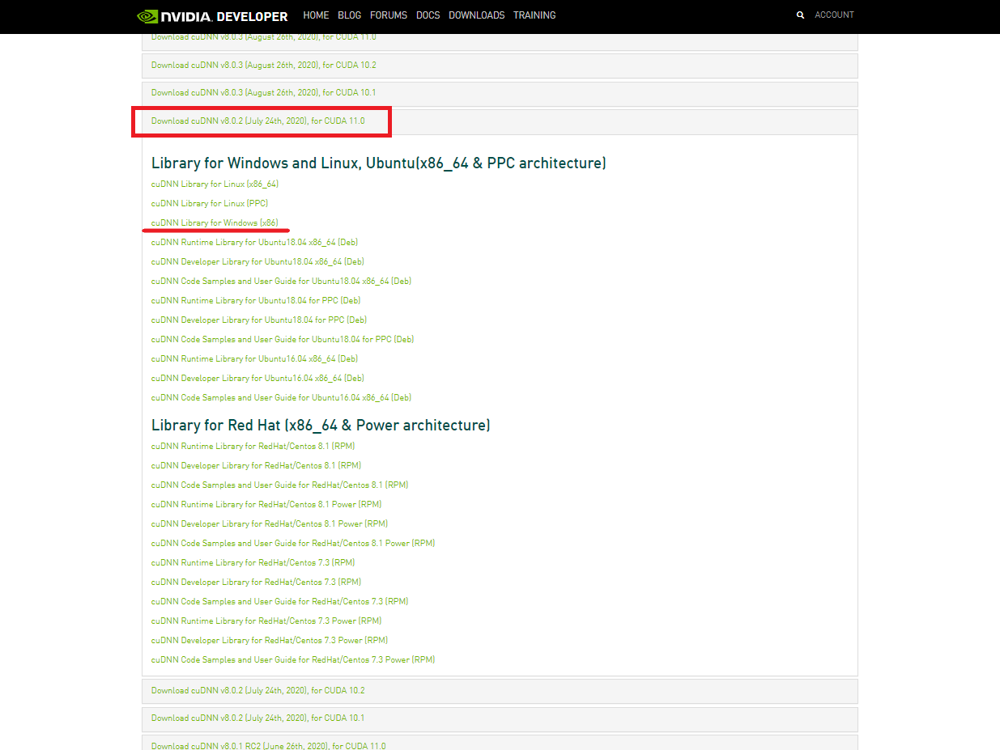
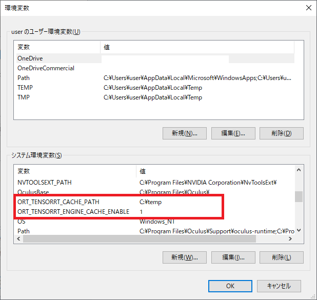

# 目次

- [MocapForAllって何？](#MocapForAllって何？)

- [MocapForAllのインストール方法](#MocapForAllのインストール方法)

- [使い方１：モーションキャプチャするための準備編](#使い方１：モーションキャプチャするための準備編)

  - [カメラの用意](#カメラの用意)
  - [カメラ校正](#カメラ校正)
  - [アプリ上での調整](#アプリ上での調整)

- [使い方２：キャプチャしたモーションの利用編](#使い方２：キャプチャしたモーションの利用編)
  - [VMTによるSteamVR連携](#VMTによるSteamVR連携)
  - [VMCプロトコルによるアプリ連携](#VMCプロトコルによるアプリ連携-1)
  - [BVH形式での書き出し](#BVH形式での書き出し)
  - [UE4, UE5, Unityへのデータ連携具体例](#ue4-ue5-unityへのデータ連携具体例)

- [使い方３：その他の設定編](#使い方３：その他の設定編)

- [FAQ](#FAQ)

- [既知のバグ](#既知のバグ)

  

# MocapForAllって何？

## 万人のためのモーションキャプチャシステム

### 特別な装置不要

下記のものがあれば、人の動きをキャプチャすることができます。

- ミドルクラスのPC
- 2台以上のウェブカメラ
- 2.5m x 2.5mくらいの空間

ウェブカメラはウェブ会議で使用するような一般的なものを使用できます。またスマートフォンやタブレットをWebカメラ化するアプリを利用することもできます。

### ミドルクラスのPCでリアルタイム
例えば、専用のGPUを持たない Surface Pro 7 で 17fps前後、GTX1080Ti なら 30～60fpsで動作させることができます。
### 安い（9999円）
予算が限られているインディーズでの製作活動、教育目的や社内での利用などに選択肢として加えることができます。	
## MocapForAllでできること
キャプチャ結果を、VMTプロトコル(※1) および [VMCプロトコル](https://protocol.vmc.info/) でネットワーク上に(※2)リアルタイムで出力することができます。また、キャプチャ結果をBVH形式のファイルに保存することができます。

> (※1 ここでの「VMTプロトコル」とは、[Virtual Motion Tracker](https://gpsnmeajp.github.io/VirtualMotionTrackerDocument/) の通信で使用されるメッセージのフォーマットを指します。Virtual Motion Trackerの公式HPでは「VMTプロトコル」という呼称は用いられていませんが、MocapForAllでは便宜上「VMTプロトコル」という呼称を使用しています)
>
> (※2 VMTプロトコルもVMCプロトコルも、UDP/OpenSound Controlにより通信を行います)
>

これらにより下記に述べるような利用が可能であるとともに、いずれの出力仕様も公開されたものであるため、自身で受信側のプログラムを製作することも可能です。

### Virtual Motion TrackerによるSteamVR連携
[Virtual Motion Tracker](https://gpsnmeajp.github.io/VirtualMotionTrackerDocument/)を介して、キャプチャ結果を仮想トラッカーとしてSteamVRで動作するアプリケーションで使うことができます。

### UE4, UE5, Unityへのデータ連携

UnrealEngine4, UnrealEngine5, Unityへキャプチャ結果を送信し、ゲーム開発や映像製作に利用することができます。   
VMTプロトコルを用いて、（Virtual Motion TrackerとSteamVRは使わずに）UE4, UE5, Unityへ直接データを連携するためのプラグインを[こちら](https://booth.pm/ja/items/3026430)で公開しています。  
また、[VMCプロトコルによるアプリ連携](#VMCプロトコルによるアプリ連携)に記載の通り、VMCプロトコルを用いて、EVMC4UやVMC4UEによる連携も可能です。

### VMCプロトコルによるアプリ連携
VMCプロトコルを介して、様々なアプリケーションに情報を連携することができます。動作確認済みのアプリケーションは下記の通りです。

- [VirtualMotionCapture](https://vmc.info/)へのトラッカーの送信
- [VSeeFace](https://www.vseeface.icu/)へのボーンの送信、VSeeFaceからの表情モーフの受信
- [EVMC4U](https://github.com/gpsnmeajp/EasyVirtualMotionCaptureForUnity)へのボーンと表情モーフの送信
- [VMC4UE](https://github.com/HAL9HARUKU/VMC4UE)へのボーンと表情モーフの送信

### BVH形式での書き出し
BVH形式ファイルでキャプチャ結果を保存することができます。Blender等で利用できます。

### ※概要図
 

# MocapForAllのインストール方法
## ダウンロード方法
### 無料試用版
BOOTHにて無料体験版配布しています。  
https://akiya-souken.booth.pm/items/3026474

有料版の購入には、無料版の試用が条件となります。購入をご検討の方は、まずはこちらをダウンロードして動作確認を行ってください。  
無料版では、キャプチャ結果を外部にエクスポートする機能に制限が設けられています。

- VMTプロトコル、VMCプロトコルでのデータ送信は、10秒ごとに送信の停止・再開が繰り返されます
- BVHファイルは、300フレームまでに制限されます

### 有料版
購入前に、無料試用版でソフトウェアがお客様の環境で問題なく動作することを必ずご確認ください。  
購入前に下記URLへお進みいただき、利用規約を必ずご確認ください。  
同意いただける場合は、購入用パスワードが入手でき、BOOTHの購入ページへお進みいただけます。  
https://vrlab.akiya-souken.co.jp/product#buy

BOOTHでの購入には、pixivアカウントが必須です。ご了承ください。

## インストール方法
[手動でのインストール](#手動でのインストール)と、[ネットワークインストーラでのインストール](#ネットーワークインストーラでのインストール)の二つの方法があります。

### 手動でのインストール

#### 本体
1. 「MocapForAll_Full_vN.N.N.zip」をダウンロードして展開（解凍）します。  
2. 「MocapForAll_Full_vN.N.N」フォルダでMocapForAll.exeを実行します。  
3. 「UE4 Prerequisites」のインストール画面が表示された場合は、インストールしてください。  

#### 付録（省略可）
##### ・Appendix

Appendixに付属の機能が不要な場合はこの手順はスキップしてください。
Appendixは下記の4種類があります。

- Appendix1：Precision mode  
  精度重視の「Precision」モードが使えるようになります。処理負荷が非常に高いため、VRアプリ等との併用はおすすめできません。
- Appendix2：HDRI maps  
  [HDRI Haven](https://hdrihaven.com)の HDRI画像を背景に用いたいくつかのマップを追加します。MocapForAll単独で動かして遊ぶ（そんな用途あるかしら？）のに使えるかもしれません。
- Appendix3：MetaHuman character  
  Epic Games の MetaHuman Creator によって作成されたキャラクターを追加します。MocapForAll上でのキャプチャ精度の確認に使用します。
- Appendix4：TensorRT mode  
  TensorRTによるGPUアクセラレーション機能を追加します。後述の通りCUDA, cuDNN, TensorRTを別途インストールする必要があります。多くの人は、標準装備のDirectMLで事足りると思います。

##### 　Appendixのインストール手順
1. 「AppendixN_xxxxx_yyyyy.zip」をダウンロードして展開（解凍）します。 
2. 「MocapForAll_Full_vN.N.N\MocapForAll」を「AppendixN_xxxxx_yyyyy\MocapForAll」で上書きします。  
3. 「Appendix4_TensorRT_mode」を使用する場合は、下記の手順を実行します。

##### ・TensorRTのインストール

詳細

このセクションは、1ms/フレームでもパフォーマンスを向上させたいガチ勢のみを対象としています。  
（例えば開発環境のGTX1080Tiだと、TensorRTはDirectMLに比べてPrecisionモードで 約1ms/フレーム/カメラ だけ優れた性能を発揮します）  
CUDA、cuDNN、TensorRTをサポートするNvidia製のGPUが必要です。  
RTX30**シリーズはサポートされていません。  

1. 「CUDA11.0.3」を「[こちら（外部リンク）](https://developer.nvidia.com/cuda-11.0-update1-download-archive?target_os=Windows&target_arch=x86_64&target_version=10&target_type=exenetwork)」からインストールします。  
    インストーラーがNVIDIAドライバーのインストールに失敗する場合があることに注意してください。その場合は、最新のNVIDIAドライバーを手動でインストールしてください。  
      
2. 「cuDNN v8.0.2 (July 24th, 2020), for CUDA 11.0」を「[こちら（外部リンク）](https://developer.nvidia.com/rdp/cudnn-archive)」からダウンロードして展開（解凍）します。　 
      
3. 展開（解凍）されてできた、  
* cudnn-11.0-windows-x64-v8.0.2.39\cuda\bin
* cudnn-11.0-windows-x64-v8.0.2.39\cuda\include
* cudnn-11.0-windows-x64-v8.0.2.39\cuda\lib  
の3つのフォルダをコピーして、「C:\Program Files\NVIDIA GPU Computing Toolkit\CUDA\v11.0」へ貼り付け下記同名フォルダを上書きします。  
* C:\Program Files\NVIDIA GPU Computing Toolkit\CUDA\v11.0\bin
* C:\Program Files\NVIDIA GPU Computing Toolkit\CUDA\v11.0\include
* C:\Program Files\NVIDIA GPU Computing Toolkit\CUDA\v11.0\lib  
4. システム環境変数に、変数名「CUDNN_PATH」を新規で追加し、その際に変数値を「C:\Program Files\NVIDIA GPU Computing Toolkit\CUDA\v11.0」に設定します。  
    ※システム環境変数は、「スタートメニュー→設定→システム→詳細情報→関連設定：システムの詳細設定→環境変数」で、新規追加が可能です。  

5. 「TensorRT7.1.3.4」を「[こちら（外部リンク）](https://developer.nvidia.com/nvidia-tensorrt-7x-download)」からダウンロードして展開（解凍）します。  
    ※NVIDIAアカウントが必要となります。お持ちでない方は、新規作成をお願いします。  
      
    
6. 上記Zipを展開（解凍）したフォルダの中のlibフォルダを環境変数「Path」に編集で変数値を新規で追加します。  
    （変数値例：「C:\Program Files\NVIDIA GPU Computing Toolkit\TensorRT-7.1.3.4\lib」）  

7. システム環境変数に、変数名「ORT_TENSORRT_ENGINE_CACHE_ENABLE」を新規で追加し、その際に変数値を「1」に設定します。  

8. システム環境変数に、変数名「ORT_TENSORRT_CACHE_PATH」を新規で追加し、その際に変数値をキャッシュファイルを保存する任意のパス（「C:\temp」など）に設定します。）  
    （TensorRTのその他のオプションについては、「[こちら（外部リンク）](https://www.onnxruntime.ai/docs/reference/execution-providers/TensorRT-ExecutionProvider.html#configuration-options)」を参照してください） 　
    （環境変数は下記のようになります。）  

      
    

​    （環境変数「Path」は下記のようになります。）  
    

### ネットーワークインストーラでのインストール
1. 「Network_Installer_-_MocapForAll_Full_vN.N.N.zip」をダウンロードして解凍します。

2. 「Network_Installer_-_MocapForAll_Full_vN.N.N.exe」を実行します。

3. 必要なAppendixを選択します。Appendixの中身は「手動でのインストール手順」の「[付録](#付録（省略可）)」を参照してください。

   「Appendix4_TensorRT_mode」を使用する場合は、「[TensorRTのインストール](#TensorRTのインストール)」を参照し、必要なソフトウェアをインストールしてください。

4. スタートメニューからMocapForAllを実行するか、インストールパスでMocapForAll.exeを実行します。

5. 「UE4 Prerequisites」のインストール画面が表示された場合は、インストールしてください。

## アップデート方法

### 手動でのアップデート

1. 「MocapForAll_Full_vN.N.N.zip」をダウンロードして（解凍）します。  
2. 「MocapForAll_Full_vN.N.N」で、古いバージョンの「MocapForAll_Full_vM.M.M」を上書きします。

### ネットーワークインストーラでのアップデート

インストール時と同じです。

ただし、ダウンロードするデータ量を削減したい場合は、インストーラの「Select Components」画面でAppendixは特に選択せず「Main Files」のみを選択し、インストールを実行します。  
インストーラではファイルの削除は行わないので、以前のAppendixは残っている状態です。  
これ以降、インストーラの「Select Components」画面ではAppendixがインストールされていない扱いになりますが、問題ありません。

# 使い方１：モーションキャプチャするための準備編

## カメラの用意
MocapForAllがインストールされたPCに接続可能なWEBカメラやスマートフォンをご用意ください。  
スマートフォンを使用する場合は[DroidCam](https://www.dev47apps.com/)や[Iriun](https://iriun.com/)など、スマートフォンをPCのWebカメラとして利用できるアプリをご利用ください。  

### どんなカメラがいいの？
#### ウェブカメラ or スマホ
ウェブカメラとスマートフォンどちらがより精度が高い等のデータはありません。お手元の機材を実際に接続して確認するのが一番です。  
スマートフォンなどのバッテリー駆動の機材を使用する際は、バッテリー切れにご注意ください。  
なお、MocapForAllの公式からの動画は、有線のカメラを使用していると明記しているもの以外は、すべてスマホとタブレットを無線で接続して動作させています。

#### 有線 or 無線
MocapForAllのキャプチャ結果は、現実の人の動きに対して遅延します。その遅延の大部分は、カメラ画像がPCに転送されるのに要する時間です。  
有線カメラの方が無線カメラより遅延が小さいことが多いです。また、スマートフォンをWebカメラ化するアプリや仮想カメラを使用すると、遅延が大きくなる傾向にあることに注意してください。  
VR機器と組み合わせて使用する場合、遅延ができるだけ小さくなるように構成するのがおすすめです。

#### 視野角、フレームレート、画像サイズ
それぞれ推奨値は設けておりませんが、参考までに以下をご確認ください。  
- **視野角**は広い方がモーションキャプチャできる空間を広く確保できます。しかし、MocapForAllではシンプルなピンホールカメラモデルで三次元位置を計算しているため、魚眼レンズのように画像に歪みが生じると動きを正しくキャプチャできません。歪みが少なく、視野角の大きいカメラが最も適しているといえます。参考までに、例えば視野角120°のウェブカメラで適切に動作しているという報告がいくつか上がっています。   
- **フレームレート**が低い場合、その値がキャプチャ結果のフレームレートのボトルネックとなり得ます。使用するPCの性能を勘案した上で、ご自身が目標とされるキャプチャ結果のフレームレート以上のカメラをご用意ください。なお、MocapForAll自体の処理能力は、例えばGTX1080Tiを使う場合、MocapForAll単独で動作させて60fps、VRと同時に使用して20fps程度が目安です。   
- **画像サイズ**は、体の動きのキャプチャの精度にはあまり寄与しません。640x480ピクセル程度で十分です。というのも、内部の処理で、人のいる領域の画像を切り抜いたあと256x256ピクセル等に縮小してAIへのインプットとしているためです。ただし、手や顔のキャプチャも行う場合は、同様の処理を手や顔という小さな領域に対して行うため、画像サイズ（と解像度）が大きい方が精度が向上します。私たちは通常HD程度の画像サイズのカメラを使用しています。

### どんなカメラ配置がいいの？
下記を踏まえた上で、最低2台のカメラに同時に全身が映る位置へカメラを設置する必要があります。  

#### 垂直方向：胸～目線の高さ
カメラを設置する高さはキャプチャ対象の胸～目線の高さをおすすめします。  
極端に見上げる・見下げる設置となる場合キャプチャの精度が下がる傾向があります。   

#### 水平方向：正面左右45° + α
カメラの水平方向の位置は、キャプチャ対象正面からそれぞれ45°程度の角度をつけての設置がおすすめです。  
キャプチャ対象と2つのカメラが一直線上に位置してしまうと奥行方向の情報が不足し精度が下がる傾向があります。  
参考として我々が設置しているカメラの位置をご紹介します。  
    

#### カメラ台数と精度、負荷
カメラの台数を増やすことでキャプチャ対象の死角が減るため、精度（というより正確度）の向上が期待できます。しかしこれについての定量的なデータはありません。  
カメラ台数にほぼ比例してPCへの負荷も上昇するため、カメラを増やすとPCのスペックによってはキャプチャ結果のフレームレートが低下します。  
まずはカメラ2台での運用から始め、死角によって問題が生じることがわかった場合にカメラの追加を検討することをおすすめします。  

（参考）  
[椅子に座っている人のキャプチャ-カメラ2台でのキャプチャ結果](https://twitter.com/i/status/1397023364623998977)  
[椅子に座っている人のキャプチャ-カメラ4台でのキャプチャ結果](https://twitter.com/i/status/1397121208257110019)  

## カメラ校正
### カメラ校正とは？
カメラ校正は、カメラ画像中での位置と現実世界での位置を対応付けるための情報を取得する作業です。この節では、カメラ校正で何をやっているのかの概念といくつかの注意点を説明します。  

MocapForAllのカメラ校正では、下記の二つの情報を取得します。

- 内部パラメータ（カメラ自体の特徴）
- 外部パラメータ（カメラの実世界での位置）

#### 内部パラメータとは
カメラのレンズの焦点距離 *f* および光軸の位置 *Cx, Cy* といった、**カメラそれ自体の特徴**を表す情報です。  
これはカメラ（とレンズ)に固有のもので、基本的に変化しません。そのため、**一度正しく取得すればそれ以降は再取得は不要**になります。  
数学的には、「カメラ画像中の座標」と「カメラ座標系での座標」の関係を記述する行列で表されます。アプリ画面上に表示されているのはこの値です。  
  

  

##### オートフォーカスについての注意
オートフォーカスが入っているカメラは、フォーカスが変化すると焦点距離が変わってしまうため、内部パラメータも変わってしまうことに注意してください。  
経験的には、一般的な携帯電話のレベルのオートフォーカスではいちいち内部パラメータの再取得をせずとも問題になることはないですが、もし高い精度が出ない場合はカメラのオートフォーカスを疑う必要があるかもしれません。  

#### 外部パラメータとは
カメラが現実世界のどこにあってどういう向きを向いているかという、**カメラの実世界での位置**を表す情報です。  
原理的には、カメラを部屋の中で完全に固定してしまえば変化しないものとして扱うことができますが、カメラを固定したつもりでも**時間の経過とともに少しずつずれてしまったりするので、基本的には使用開始時に毎回再取得**することをお勧めします。  
数学的には、「カメラ座標系での座標」と「世界座標系での座標」の関係を記述する行列で表されます。アプリ画面上に表示されているのはこの値です。

  

  

##### 外部パラメータの取得の4つの方式
MocapForAllでは、外部パラメータの取得には下記の4つのやり方があります。それぞれ、準備と実施方法が異なるので注意してください。

|  やり方  |  精度  |  手軽さ  |  使える空間の大きさ  | 　評価  |
| ---- | ---- | ---- | ---- | ---- |
|  1. ChArUcoボードを使うやり方 |  ◎  |  △  |  △  | 一番精度が出ますが、準備にちょっとした工作が必要になる方式です。**長期的にはこのやり方が一番楽だと思います。** |
|  2. ArUcoクラスターを使うやり方   |  ○  |  ○  |  ○  | 精度と準備の手軽さを兼ね備えた方式です。**はじめての人は、まずはこのやり方で試してみることをお勧めします。** |
|  3. Diamondクラスターを使うやり方 |  ◎  |  ×  |  ◎  | 準備が大変ですが、複数のマーカの相対位置を別途測定することにより、多数のカメラで広範囲をキャプチャをしたい場合などに使えるやり方です。 |
|  4. 人の動きを使うやり方    |  △  |  ◎  |  ○  | マーカを印刷できない、あるいは、マーカの設置に適さない環境（例えば野外）でキャプチャをする場合に使えるやり方です。 |

### カメラ校正の準備1：ARマーカの印刷
カメラ校正を行うためには、「位置がわかっている現実世界の座標がカメラ画像上でどこにあるか」を知る必要があります。そこで、下記に述べる「特定の画像」を実際に使うカメラで撮影してもらい、その撮影結果から上述のカメラの情報をアプリ側で算出する、ということを行います。  
この節では、カメラ校正の準備として、これらの画像を印刷していきます。

#### 内部パラメータの取得で使う画像の印刷
[この画像](https://raw.githubusercontent.com/Akiya-Research-Institute/MocapForAll-Wiki/main/resources/calibration/IntrinsicCalibration.png)を使います。  
まだカメラを部屋の中で固定していない場合は、印刷は不要です。この画像をPCのディスプレイに表示して使います。  
すでにカメラを固定済みの場合は、上記の画像をA4程度の大きさで印刷してください。大きさは厳密である必要はありません。ダンボールなどに貼り付けて平面の状態を保てるようにしておいてください。  
  

#### 外部パラメータの取得で使う画像の印刷
先に説明した[外部パラメータの取得の4つの方式](#外部パラメータの取得の4つの方式)により、使用する画像が異なります。

1. ChArUcoボードを使うやり方  
[この画像](https://raw.githubusercontent.com/Akiya-Research-Institute/MocapForAll-Wiki/main/resources/calibration/ExtrinsicCalibration.png)を使います。これを**できればA2以上**のサイズで印刷してください。  
「A2で印刷できるプリンタがない！」という場合（私もです）、画像を二つにわけてA3用紙2枚に印刷し、テープでくっつけるのがおすすめです。  
  
このようにダンボールなどに貼り付け、きれいな平面の状態を保てるようにしておくと、後々まで使い続けることができます。  
（上の写真のものは3か月ほど使い込んでいますが、現役です)
2. ArUcoクラスターを使うやり方  
    [このzip](https://github.com/Akiya-Research-Institute/MocapForAll-Wiki/raw/main/resources/calibration/ArucoMarkers.zip)にある"ArucoMarker0.png"と"同1"、"同2"を使います。これをA4かA3サイズで印刷してください。それほど広くない部屋ならA4で十分です。  
      
3. Diamondクラスターを使うやり方  
    [このzip](https://github.com/Akiya-Research-Institute/MocapForAll-Wiki/raw/main/resources/calibration/DiamondMarkers.zip)にある"diamondMarker0.png"およびそれ以降を使います。「1.ChArUcoボードを使うやり方」と同様に、A2以上のサイズで印刷してください。 
4. 人の動きを使うやり方  
    特に準備するものはありません。

### カメラ校正の準備2：マーカのサイズの計測
外部パラメータの取得で使う画像については、実際に印刷された画像のサイズを測る必要があります。これがキャプチャされた動きのスケールの基準になります。  
先に説明した[外部パラメータの取得の4つの方式](#外部パラメータの取得の4つの方式)により、下記の通り計測する箇所が異なります。  

1. ChArUcoボードを使うやり方  
.png)   
上記の赤矢印の長さを測ります。計測結果をMocapForAllの「Settings > Calibration > Maker size (affects to coord. scale) > **ChArUco board** [m]」に入力します。単位はメートルです。  
   

2. ArUcoクラスターを使うやり方  
  
上記の赤矢印の長さを測ります。計測結果をMocapForAllの「Settings > Calibration > Maker size (affects to coord. scale) > **ArUco marker** [m]」に入力します。単位はメートルです。

3. Diamondクラスターを使うやり方  
  
上記の赤矢印の長さを測ります。計測結果をMocapForAllの「Settings > Calibration > Maker size (affects to coord. scale) > **Diamond marker** [m]」に入力します。単位はメートルです。

4. 人の動きを使うやり方  
自身の身長を測ります。計測結果をMocapForAllの「Settings > Calibration > Maker size (affects to coord. scale) > **Human hight** [m]」に入力します。単位はメートルです。

### カメラの接続
少なくとも2台のカメラをPCに接続します。  
MocapForAllのウィンドウ上部の「Add camera」ボタンを使用するカメラの数だけクリックします。  
「Camera:」の横のプルダウンボックスを選択し、接続したカメラを探します。   
 

「Image size」横のボックスにサイズを入力し「Apply」をクリックすると、カメラの画像サイズを変更できます。（カメラが指定された画像サイズをサポートしている必要があります。）
カメラの画像サイズの変更に失敗することがありますが、その場合はカメラを閉じてから少し待って、再度お試しください。

画像の左右反転ができます。一部のカメラはデフォルトで画像が鏡像になっていることに注意してください。画像が鏡像になっているとARマーカが読み込めません。

画像の回転ができます。キャプチャ開始時点は人が真っすぐ立っている画像でなければ認識できないので、カメラの設置状況に合わせて画像を適切に回転しておいてください。

#### カメラ制御フレームワークの選択
MocapForAllのウィンドウ上部の「Add camera」の横の「▼」を押すと、カメラの制御に使うフレームワークを選択できます。    

 

- **Direct show:** Microsoftのメディアフレームワーク。OBS-VirtualCamプラグインが使えます。
- **UE4 media player:** UE4のメディアフレームワーク。高解像度での性能に優れています。一部のカメラは動作しないようです。

UE4 media playerで動作するカメラならば、そちらがおすすめです。動作しない場合はDirect Showを使いましょう。

### 内部パラメータのカメラ校正手順
[内部パラメータの取得で使う画像の印刷](#内部パラメータの取得で使う画像の印刷)で画像を印刷していない場合は、[この画像](https://raw.githubusercontent.com/Akiya-Research-Institute/MocapForAll-Wiki/main/resources/calibration/IntrinsicCalibration.png)を任意のアプリで画面にできるだけ大きく表示します。

MocapForAllで「Camera > Calibration > Intrinsic」の下の「Start」ボタンをクリックします。  
10秒間程度、さまざまな角度からカメラで画像を写してください。カメラを固定済みの場合は、カメラでなく画像の方を動かします。  
カメラ校正が完了すると、アプリの画面上に内部パラメータが表示され、「Intrinsic  ☑Calibrated」となります。

　

完了したら「Save」からカメラ校正結果を保存しておきます。

### 外部パラメータのカメラ校正手順

先に説明した[外部パラメータの取得の4つの方式](#外部パラメータの取得の4つの方式)により、手順が異なります。

1. ChArUcoボードを使うやり方  
    [外部パラメータの取得で使う画像の印刷](#外部パラメータの取得で使う画像の印刷)で印刷した画像を床に置きます。これがモーションキャプチャの原点になります。  
    床に置いた画像が見える場所にカメラを設置します。  
  
    MocapForAllで「Settings > Calibration > Extrinsic calibration method」で「**ChArUco board (default)**」を選択します。
    「Camera > Calibration > Extrinsic」の下の「Start」ボタンをクリックします。キャリブレーションが完了すると、外部パラメータが表示され、「Extrinsic  ☑Calibrated」となります。
  
    マーカの読み取りがうまく実施できない場合は、[マーカをうまく読み取れない場合](#マーカをうまく読み取れない場合)を試してみてください。

    
    
    
    
2. ArUcoクラスターを使う方法  
    [外部パラメータの取得で使う画像の印刷](#外部パラメータの取得で使う画像の印刷)で印刷した画像を床に置きます。「arucoMarker0.png」がモーションキャプチャの原点になります。  
    床に置いた画像が見える場所にカメラを設置します。  

    MocapForAllで「Settings > Calibration > Extrinsic calibration method」で「**ArUco cluster**」を選択します。
    「Camera > Calibration > Extrinsic」の下の「Scan markers」ボタンをクリックします。マーカの位置関係がスキャンされ、しばらくすると3Dビューポート上にマーカが表示されます。

    マーカがスキャンできたら「Stop scanning」をクリックし、次に「Start」ボタンをクリックします。キャリブレーションが完了すると、外部パラメータが表示され、「Extrinsic  ☑Calibrated」となります。  

    マーカの読み取りがうまく実施できない場合は、[マーカをうまく読み取れない場合](#マーカをうまく読み取れない場合)を試してみてください。

    
    
    
    
3. Diamondクラスターを使う方法  
    [外部パラメータの取得で使う画像の印刷](#外部パラメータの取得で使う画像の印刷)で印刷した画像を、カメラのフレームに収まる程度の距離をおいて配置します。同一平面内にある必要はありません。「diamondMarker0.png」がモーションキャプチャの原点になるので、これは床面に置きます。

    MocapForAllで「Settings > Calibration > Extrinsic calibration method」で「**Diamond cluster**」を選択します。

    任意のカメラの一つで「Camera > Calibration > Extrinsic」の下の「Scan markers」ボタンをクリックします。そのカメラで、「diamondMarker0.png」を映します。次に「diamondMarker0.png」といずれかのマーカを同時に映してしばらくその状態を維持します。しばらくすると「diamondMarker0.png」を原点としてもう一つのマーカの位置が確定し、当該マーカが3Dビューポート上に表示されます。

    位置が確定済みのマーカと位置が未確定のマーカについて、上記の作業を繰り返し、全マーカの位置が確定したら「Stop scanning」をクリックします。

    位置が確定済みのマーカが映る位置にカメラを設置し、「Camera > Calibration > Extrinsic」の下の「Start」ボタンをクリックします。キャリブレーションが完了すると、外部パラメータが表示され、「Extrinsic  ☑Calibrated」となります。  

    

4. 体の動きを使う方法  
    少なくとも二つのカメラが同時に人を映せるようにカメラを設置します。

    MocapForAllで「Settings > Calibration > Extrinsic calibration method」で「**Human motion**」を選択します。  
    また、ハードウェアが対応していれば、「Settings > General > Run DNN on」を「**GPU_DirectML**」にします。（AppendixのTensorRTモードをインストール済みの場合は「GPU_TensorRT」でもOKです）  
    ハードウェアの性能が許せば、「Settings > General > Prioirty on」を「**Speed**」に設定します。（AppendixのPrecisionモードをインストール済みの場合は「Precision」でもOKです）

    **ウィンドウ上部の「Start calibration」ボタン**をクリックし、全身がカメラに映る場所を歩き回ってください。  
    カメラに同時に映る人体の関節位置からカメラの相対位置が決定され、一つ目のカメラを基準にして外部パラメータが決定されます。全カメラの外部パラメータが決定され、「Extrinsic ☑Calibrated」となります。  
    
    最後に、次に説明する[マーカをうまく読み取れない場合](#マーカをうまく読み取れない場合)と同じように、ウィンドウ上部の「Find Ground」ボタンをクリックして適当に歩きまわり、カメラの絶対位置を決定します。
    
    
    

#### マーカをうまく読み取れない場合

マーカの位置がキャプチャ結果の高さゼロの面となるため、基本的にマーカは床に置くことを推奨していますが、カメラの性能や配置によっては床においたマーカを読み取ることが難しい場合があります。

そのような場合、**マーカを壁に掛けてカメラ校正を行い、床面の位置はあとから調整**することができます。

手順：
- 印刷した画像を「床に置き」となっているところを「**適当な壁に掛け**」に読み替えてカメラ校正を実施します。
- ハードウェアが対応していれば、「Settings > General > Run DNN on」を「**GPU_DirectML**」にします。（AppendixのTensorRTモードをインストール済みの場合は「GPU_TensorRT」でもOKです）  
  ハードウェアの性能が許せば、「Settings > General > Prioirty on」を「**Speed**」に設定します。（AppendixのPrecisionモードをインストール済みの場合は「Precision」でもOKです）
- ウィンドウ上部の「**Find Ground**」をクリックし、全身が複数のカメラに映る場所を歩き回ります。しばらくすると、自動的に床面の位置が調整されます。

#### カメラ校正結果の確認

[カメラ校正の準備2：マーカのサイズの計測](#カメラ校正の準備2：マーカのサイズの計測)で正しい値を入力していれば、3Dビューポート上でカメラの位置を確認できます。視点の移動方法は、[視点の移動](#視点の移動)を参照してください。

カメラが床より下の位置に表示される場合がある可能性があることに注意してください。（この場合、カメラ校正が失敗しています）

### カメラ校正結果の保存と読み込み

カメラ校正が完了したら、「Camera > Calibration > Intrinsic」と「Extrinsic」の下の「Save」から、各カメラの校正結果を保存しておきます。保存した結果は「Load」から読み込むことができます。

また、ウィンドウ上部の「Save All Cameras」ボタンと「Load All Cameras」ボタンをクリックして、カメラ設定全体を保存およびロードできます。
「Save All Cameras」では、カメラの選択はプルダウン内の何番目かという情報で保存されることに注意してください。 PCからカメラを取り外すと、プルダウン内のカメラの順序が変わり、カメラを正しくロードできなくなります。

## アプリ上での調整

前節までの作業に加え、アプリ上でいくつかのパラメータを調整する必要があります。

### 視点の移動

これ以降の操作を行う前提として、キーボードとマウスのドラッグでMocapForAll上で視点を移動させることが出来ます。
「W」「↑」・・・ズームイン
「A」・・・画面左へスライド
「S」「↓」・・・ズームアウト
「D」・・・画面右へスライド
「←」・・・左へ回転
「→」・・・右へ回転
「スペース」・・・アップ
「左Ctrl」・・・ダウン
画面の最大化は、F11キーでオンオフできます。

### スケールの調整

 

ウィンドウ上部の「Start capture」をクリックし、二つ以上のカメラに全身を映すと、モーションがキャプチャされます。
キャプチャ結果を観察し、下記の通りスケールを適切に調整することで、キャラクターに動きが正しく反映されるようにしていきます。　

Virtual Motion TrackerおよびVRアプリと組み合わせて使用する場合は、後述の[SteamVRとMocapForAllの座標合わせ](#SteamVRとMocapForAllの座標合わせ)でスケールも併せて調整するので、ここでの調整は適当でOKです。

なお、上半身と下半身でスケールを分けているのは、2次元のキャラクターは一般に生身の人間より足が長いので、上半身と下半身を分けないと生身の人間のサイズと合わないからです。（そのため、上半身と下半身のスケールの比は適用したいキャラクターに依存します）

#### 下半身のスケール

腰、股関節、膝、足の位置に影響します。また、体全体の位置（root位置）もこのスケールに従います。

- キャラクターが常にしゃがんでいる場合： 「Settings > Coordinates > Scale > Lower body」の値を増やします。
- キャラクターが宙に浮いている場合： 「Settings > Coordinates > Scale > Lower body」の値を減らします。

#### 上半身のスケール

胸、首、頭、肩、肘、手、指の位置に影響します。

- キャラクターの肩が常に下を向いている場合： 「Settings > Coordinates > Scale > Upper body」の値を増やします。
- キャラクターの肩が常に上を向いている場合： 「Settings > Coordinates > Scale > Upper body」の値を減らします。

### 動きの加工の調整

 

キャプチャされた動きは、下記の加工がされたうえで画面に表示されます。好みに応じてそれらの調整を行います。　

#### 足の強制接地のオンオフ

足が地面にめり込んだり、地面から浮いたりしてしまわないよう、足が地面の近くにある場合はその位置を自動的に調整する機能があります。

- **足の接地感を重視**する場合は、「Settings > Animation Post Process > Force feet grouded」を**オン**にして上記機能を使用することをおすすめします。
- **脚全体の動きを重視**する場合は、「Settings > Animation Post Process > Force feet grouded」を**オフ**にして上記機能を使用しないことをおすすめします。

なお、「Settings > Data export > VMT protocol > Send tracking points」をオンにしたときに送信されるデータは、上記の位置調整が適用される前のものです。（つまり、**VMTでVRアプリと組み合わせて使用する場合は、ここでの設定は関係ありません**）
上記以外の外部送信データは、上記の位置調整が適用された後のものです。

足がどれくらい地面に近い場合にこの位置調整が適用されるかは、「Settings > Coordinates > Scale > Lower body」に応じて自動的に設定されます。
[カメラ校正の準備2：マーカのサイズの計測](#カメラ校正の準備2：マーカのサイズの計測)が適切に行われず、上記「Lower body」に大きな値を設定してしまっていると、足が全く地面から離れなくなることがあります。その場合は、[カメラ校正の準備2：マーカのサイズの計測](#カメラ校正の準備2：マーカのサイズの計測)と[外部パラメータのカメラ校正](#外部パラメータのカメラ校正手順)を再度実施するか、「Force feet grouded」をオフにしてください。

#### スムージングの調整

キャプチャした動きを、時系列に沿ってスムージングする機能があります。
外部送信できる各種データは、全てこのスムージングが適用された後のものです。

##### スムージングのオンオフ

通常オンの状態で使用しますが、キャプチャ結果を利用するアプリケーションで独自にスムージングを行う場合は、MocapForAll側でのスムージングをオフにすることがあります。
「Settings > Animation Post Process > Smoothing on body」および「Smoothing on finger」「Smoothing on facial expression」で、体、指、表情へのスムージングのオンオフを設定できます。

##### スムージングの強度の変更
スムージングの強度を変更することもできます。
###### スムージングのしくみ
スムージングには[1€フィルタ](http://cristal.univ-lille.fr/~casiez/1euro/)を使用しています。1€フィルタとは、端的に表現すると「速さに比例してカットオフ周波数が増加するローパスフィルタ」です。通常のローパスフィルタは、ノイズを抑えようとすると機敏な動きへ追随することができなくなってしまいますが、1€フィルタでは、**機敏な動きに対してはノイズ抑制を緩くしてやることで、低速でのノイズを抑えつつ機敏な動きへの追従性も確保する**ことができます。

下記の3つの項目を調整することができます。

- fc0: 速さゼロにおけるカットオフ周波数。**これが小さな値であるほど、低速でのノイズが抑制されます**。
- Beta: 速さに比例してカットオフ周波数がどれだけ増加するか。**これが大きな値であるほど、機敏な動きに追随できます**。
- fcv: 速さに対するカットオフ周波数。速さに対しては、この値で指定されるカットオフ周波数を持つ通常のローパスフィルタが適用されます。

###### スムージングの強度の調整手順
- キャプチャを開始し、まず、体を動かさず真っすぐ立った時のノイズを観察します。ノイズが気になる場合は、fc0を減らします。

- ノイズが十分抑えられたら、次に、キャプチャ目的に応じた適当な速さで体を動かします。動きに追随できていない場合は、Betaを増やします。

### 負荷対策

使用するPC環境と用途にあわせて、負荷を下げるよう設定します。

  

#### フレームレートの確認

- 「Settings > Performance > Show frame rate」を**オン**にすると、現在のフレームレートがウィンドウ下部に表示されます。 

#### CPUよりGPU

MocapForAllではAIを使って人の姿勢を推定しています。AIの計算は、多くの場合、CPUよりGPUを使う方が高速です。
「Settings > General > Run DNN on」から、CPUを使うかGPUを使うかを選択できます。また、GPUが複数ある場合は、どのGPUを使うかも選択できます。

GPUを使う場合、二つの選択肢があります。TensorRTは環境準備が大変かつ読み込み時間が長く、それでいて見返りが少ないため、多くの場合「**GPU_DriectML**」 の使用をおすすめします。

- GPU_DriectML
  DirectMLは、DirectX12対応GPUでGPUアクセラレーションを可能にします。使用可能なハードウェアの例は次の通りです。
  - NVIDIA Kepler（GTX 600シリーズ）以降
  - AMD GCN 1st Gen（Radeon HD 7000シリーズ）以降
- GPU_TensorRT
  TensorRTは、サポートされているNVIDIA製GPUでGPUアクセラレーションを可能にします。
  これを使用するには、CUDA、cuDNN、およびTensorRTをインストールした上で、「Appendix4_TensorRT_mode」をインストールする必要があります。詳細は、[TemsorRTのインストール手順](#TemsorRTのインストール)を参照してください。

#### 速度優先モード

「Settings > General > Prioirty on」から、何を優先して実行するかを設定できます。

- 多くの用途で「**Speed**」をおすすめします。
- ノートPCなど性能が低いPCを利用している場合や、非常に重いVRアプリと併用する場合などは、「Speed+」をおすすめします。
- 映像用途等で特に精度よくモーションキャプチャしたい場合には、「Precision」モードを使用します。「[付録](#付録（省略可）)」のAppendix1のインストールが必要です。

#### 描画を減らす

下記の設定により、MocapForAll上での描画を減らし負荷を削減することができます。

- 「Settings > General > Character」で「**Empty**」キャラクターを選択します。
- 「Settings > General > Map」で「**Minimum**」マップを選択します。
- 「Settings > Performance > Set screen percentage to」を**オン**にし、小さな値 (たとえば 30%) を設定します。

#### フレームレートの上限を設定する

- 「Settings > Performance > Limit framerate to:」を**オン**にし、目標とするフレームレート (たとえば 30FPS) を設定します。 
    MocapForAllはこのフレームレートを上限として動作します。

# 使い方２：キャプチャしたモーションの利用編

## VMTによるSteamVR連携
gpsnmeajp様が作成した「[Virtual Motion Tracker](https://gpsnmeajp.github.io/VirtualMotionTrackerDocument/)」と組み合わせて使用することで、MocapForAllでキャプチャした結果を仮想トラッカーとしてSteamVRで使用することができます。
仮想トラッカーを用いることで、例えばVRChatでフルボディトラッキングを実現することができます。

Virtual Motion Tracker は MocapForAll とは別のプログラムであることに注意してください。Virtual Motion Tracker と MocapForAll を一緒に利用して発生したいかなる問題についても、Virtual Motion Tracker の作成者様に問い合わせしないでください。

### Virtual Motion Trackerのインストール

- Virtual Motion Tracker を [セットアップ手順](https://gpsnmeajp.github.io/VirtualMotionTrackerDocument/setup/) の通りにインストールします。
  - 後述の[SteamVRとMocapForAllの座標合わせ](#SteamVRとMocapForAllの座標合わせ)で[自動調整機能を使う場合](#自動調整機能を使う場合)は、Virtual Motion Trackerは MocapForAll向けに改造したバージョンを使用する必要があります。[こちらからダウンロード](https://github.com/KenjiAsaba/VirtualMotionTracker/releases)し、上記のセットアップ手順と同じ手順でインストールしてください。また、MocapForAllはv1.10以降を使用する必要があります。
- 一部のアプリケーションでVMTを利用するには、[コントローラーバンディングの設定](https://gpsnmeajp.github.io/VirtualMotionTrackerDocument/advanced/#how-to-set-the-controller-bainding)を行う必要があります。

### MocapForAllのVMT送信設定

  

- 「Settings > Data export > Destination IP address for VMT and VMC」を下記の通り設定します
  - 送信先が同じPCの場合：「127.0.0.1」
  - 送信先が別のPCの場合： 送信先のPCのIPアドレス
    - コマンドプロンプトを開いて、"ipconfig /all" で確認できます
    - MocapForAllとSteamVRを別PCで実行することで、処理の負荷を分散させ、快適にVRゲームをプレイすることができます
- 「Settings > Data export > VMT protocol > Send tracking points」をオンにします
- 「Settings > Data export > VMT protocol > Send tracking points」のポートを「39570」にします
- 「Settings > Data export > VMT protocol > Send tracking points > Tracking points to be sent」の下の必要な箇所をオンにします
  - 例えばVRChatで使用する場合は、「Pelvis」と「Feet」をオンにします
    - 「Pelvis」と「Feet」については、それぞれの左横の「>」をクリックすると、仮想トラッカー位置のオフセットを調整できます。

下記設定については、好みに応じてオンオフを決定してください。まずはオンで試し、動きにこだわりたい場合にオフを試すことをおすすめします。

- 「Settings > Data export > VMT protocol > Send tracking points > As relative position to HMD」

  - **オフ**にすると、各部位の実際のトラッキング位置が、そのまま各部位の仮想トラッカーの位置として使われます。
    - ヘッドマウントディスプレイに対する、各部位の仮想トラッカーの位置情報の**遅延がそのまま見えてしまう**状態になります。  
      (例えば歩き出しは、頭だけが先行し、残りの部位が後からついてくるような見た目になります)
    - 後述の[SteamVRとMocapForAllの座標合わせ](#SteamVRとMocapForAllの座標合わせ)で、**スケールと位置を適切に設定**する必要があります。
      (スケールが一致していない場合、部屋の中での移動に応じてヘッドマウントディスプレイと各部位の水平方向の位置がずれます)

  - **オン**にすると、頭と各部位の相対位置が、ヘッドマウントディスプレイと各部位の相対位置に変換されて仮想トラッカーの位置に使われます。
    - ヘッドマウントディスプレイに対して、各部位の仮想トラッカーの位置情報の**遅延が目立ちにくくなります**。  
      (例えば歩き出しは、頭に連れて各部位が横滑りするような見た目になります)
    - 後述の[SteamVRとMocapForAllの座標合わせ](#SteamVRとMocapForAllの座標合わせ)で、**スケールは適当でOK、位置の設定は不要**になります。

### SteamVRとMocapForAllの座標合わせ

SteamVRでトラッキングされているHMDおよびコントローラの座標系と、MocapForAllでトラッキングされている体の位置の座標系は、そのままでは一致しません。これらを一致させるよう、手動または自動で調整する必要があります。

#### 手動で調整する場合

- 準備
  - MocapForAll ウィンドウ上部の「Start capture」をクリックし、モーションのキャプチャを開始します。
  - ヘッドマウントディスプレイを被り、SteamVR Homeを含むSteamVRで動いているアプリを終了し、SteamVRのデフォルト画面で仮想トラッカーを視認できる状態にします。

- スケールの調整
  - MocapForAllで
    - 「Settings > Data export > VMT protocol > Send tracking points > Tracking points to be sent」の下の「Head」をオンにします。
    - 「Settings > Data export > VMT protocol > Send tracking points > As relative position to HMD」をオフにします。
  - 自分の目線の高さと、「Head」の仮想トラッカーの高さが一致するように、「Settings > Coordinates > Scale > Upper body」および「Settings > Coordinates > Scale > Lower body」の値を設定します。「Upper body」と「Lower body」は基本的に同じ値にします。
  
- 回転の調整
  - MocapForAllで
    - 「Settings > Data export > VMT protocol > Send tracking points > Tracking points to be sent」の下の「Feet」をオンにします。
    - 「Settings > Data export > VMT protocol > Send tracking points > As relative position to HMD」をオンにします。
  - 自分の足を前後に動かし、その動く向きが足元の「Feet」の仮想トラッカーの動く向きと一致するように、「Settings > Coordinates > Coord. rotation」の値を設定します。
  
- 位置の調整

  - MocapForAllで
    - 「Settings > Data export > VMT protocol > Send tracking points > Tracking points to be sent」の下の「Feet」をオンにします。
    - 「Settings > Data export > VMT protocol > Send tracking points > As relative position to HMD」をオフにします。

  - 自分の足の位置と「Feet」の仮想トラッカーの位置が一致するよう、「Settings > Coordinates > Origin position」の値を設定します。

#### 自動調整機能を使う場合

[Virtual Motion Trackerのインストール](#virtual-motion-trackerのインストール)に記載の通り、この機能を使うには、Virtual Motion Trackerが[MocapForAll向けに改造したバージョン](https://github.com/KenjiAsaba/VirtualMotionTracker/releases)である必要があります。また、MocapForAllはv1.10以降を使用する必要があります。

- VMT Manager および 他のポート39571を使用するアプリを終了します。
- 「Settings > Data export > VMT protocol > Send tracking points」をオンにします。
- ヘッドマウントディスプレイを被り、SteamVRが起動している状態にします。
- SteamVRとMocapForAllの両方でトラッキングが成立する位置に立ちます。
- MocapForAllで、ウィンドウ上部の「Align coord. to VR」をクリックします。
- 適当に歩き回ります。しばらくすると、自動的に「Settings > Coordinates」の値が更新され、SteamVRとMocapForAllの座標が一致した状態になります。

　　

## VMCプロトコルによるアプリ連携
### VRMモデル読み込み

- VMCプロトコル連携先と同じVRMモデルを読み込みます。  
  VRMモデルを読み込むには、キャプチャを停止した状態で、VRMファイルをMocapForAllのウィンドウにドラッグ&ドロップしてください。  

　　

### モーションデータの送信

　　

- 「Settings > Data export > Destination IP address for VMT and VMC」を下記の通り設定します
  - 送信先が同じPCの場合：「127.0.0.1」
  - 送信先が別のPCの場合： 送信先のデバイスのIPアドレス
- 「Settings > Data export > VMC protocol > Send bones」をオンにします
- 「Settings > Data export > VMC protocol > Send bones」のポートを、送信先のポートに合わせて設定します

ボーン（/VMC/Ext/Bone/Pos）としてではなく、トラッカー（/VMC/Ext/Tra/Pos）としてデータを送信したい場合は、下記を設定します。  
（例えば、VirtualMotionCaptureにデータを送信するにはこの設定が必要です）

- 「Settings > Data export > VMC protocol > Send bones > As trackers (/VMC/Ext/Tra/Pos) 」をオンにします

### 表情モーフデータの受信・送信

表情モーフデータを受信するには、下記の通り設定します。

- 「Settings > Data export > VMC protocol > Receive facial morphs」をオンにします
- 「Settings > Data export > VMC protocol > Receive facial morphs」のポートを、送信元のアプリが指定している送信先ポートに合わせて設定します
- 「Settings > Data export > VMC protocol > Receive facial morphs > From other device」を下記の通り設定します。
  - 送信元が同じPCの場合：オフ
  - 送信元が別のデバイスの場合：オン

受信した表情モーフデータは、[モーションデータの送信](#モーションデータの送信)の設定がされていれば、そのまま送信されます。

## BVH形式での書き出し
### ボーン構造はVRM準拠

MocapForAll上でVRMモデルにアニメーションをリターゲットした上で、BVH形式でアニメーションをエクスポートするしくみとしています。  
そのため、BVH形式でのデータ書き出し時は、自動的にVRMを使用するモードに切り替わります。

VRMモデルをお持ちでない場合は、実際にモデルをロードせずに、「Settings > General > Character」で「VRM runtime load」を選択してください。  
ダミーのVRMモデルがバックグラウンドで使用されます。

### BVH形式での書き出し方法

- 「Settings > Data export > Record to BVH file」を有効にします。
  - 「Settings  > General > Character」が「VRM runtime load」に自動的に設定されます。
- 「Start capture」をクリックすると、BVH形式でのデータ保存が開始されます。
- 「Stop capture」をクリックすると、最終的なBVHファイルが生成されます。
  - 無料試用版の場合は、300フレーム経過時点で自動的にBVHファイルが生成され、データ保存が停止されます。

### 長さの単位はメートル

生成されるBVHファイルのボーンの長さの単位はメートルとしています。読み込み先のアプリケーションで単位を適切に設定してください。

## UE4, UE5, Unityへのデータ連携具体例
### VMTプロトコルでの直接連携プラグイン

VMTプロトコルを用いて、（Virtual Motion TrackerとSteamVRは使わずに）UnrealEngine4, UnrealEngine5, Unityへ直接データを連携するためのプラグインを[こちら](https://booth.pm/ja/items/3026430)で公開しています。

使い方の詳細は下記をご覧ください。

- [UE4版データ受信プラグインの使い方](https://github.com/Akiya-Research-Institute/MocapForAll-Receiver-Plugin-for-UE4/wiki)
- [UE5版データ受信プラグインの使い方](https://github.com/Akiya-Research-Institute/MocapForAll-Receiver-Plugin-for-UE5/wiki)
- Unity版：  MocapForAllで下記の通り設定します
  - 「Settings > Data export > Destination IP address for VMT and VMC」を下記の通り設定します
    - 送信先が同じPCの場合：「127.0.0.1」
    - 送信先が別のPCの場合： 送信先のPCのIPアドレス（コマンドプロンプトを開いて、"ipconfig /all" で確認できます）
  - 下記の何れかを設定します。
    - 「Settings > Data export > VMT protocol > Send bones」をオンにし、ポートを送信先に合わせて設定します
    - 「Settings > Data export > VMT protocol > Send tracking points」をオンにし、ポートを送信先に合わせて設定します

### VMC4UE、EVMC4Uによる連携

- [VMCプロトコルによるアプリ連携](#VMCプロトコルによるアプリ連携)に記載の通り、MocapForAllの設定を行います。
- VMC4UE
  - https://github.com/HAL9HARUKU/VMC4UE/wiki に記載の「UE4 の使い方」の通りUE4の設定を行い、UE4Editor上で実行します。（最後の「VirtualMotionCapture の使い方」は不要）
- EVMC4U
  - https://github.com/gpsnmeajp/EasyVirtualMotionCaptureForUnity/wiki/How-to-use#externalreceiverpack%E3%82%92%E4%BD%BF%E3%81%86%E5%A0%B4%E5%90%88%E3%81%8B%E3%82%93%E3%81%9F%E3%82%93 に記載の「0. Unityを準備する」から「4. 再生して実行」を実施します。

# 使い方３：その他の設定編
## 手と顔のキャプチャ
- 「Settings > General > Capture hand」をオンにすると、指の動きをキャプチャします
- 「Settings > General > Capture face」をオンにすると、顔の表情をキャプチャします

上記はいずれも実験的な機能です。処理負荷が高いこと、精度が低いことに注意してください。

### キャプチャ時のトリミングのサイズ

「Settings > Advanced > Cropping size for hand」「Cropping size for face」から、手と顔のキャプチャ時に画像を切り抜いてAIへの入力とする際のサイズを設定できます。人によって手や顔の大きさが異なるため、この値を調整すると精度が向上することがあります。

### 顔のモーフターゲット名の設定

VRM モデルを使用している場合にのみ、顔のモーフターゲット名を指定することができます。

- 「Settings > Advanced > Specify facial morph target names」をオンにします
- 各モーフターゲットの名前を入力します。

## キャラクターへの視点の追随

- 「Settings > General > Look at character」をオンにすると、視点がキャラクターの動きに追随します

## トラッキング位置の表示・非表示

- 「Settings > General > Draw tracking points」で、トラッキング位置を表す黄色い四角形の表示をオンオフできます

## 言語

- 「Settings > General > Language」で、使用する言語を設定できます。現状、日本語と英語に対応しています。

## 設定のリセット

すべての設定をリセットするには、「C:\Users\【ユーザ名】\AppData\Local\MocapForAll」を削除します。

MocapForAllが何らかの原因で起動しなくなった場合、設定をリセットすると起動することがあります。

# FAQ
## カメラが認識されません

- [カメラ制御フレームワークの選択](#カメラ制御フレームワークの選択)で、UE4 media playerを選択します
  - Image sizeから、異なるフォーマットを指定してみてください
- カメラ制御フレームワークの選択で、Direct Showを選択します
  - カメラの仕様に基づき、適切なImage sizeを指定してください

いずれでも動作しない場合、残念ですがMocapForAllでそのカメラは使用できません。

## 同機種のカメラ複数が認識されません
同機種のカメラをPCに接続する場合、アプリ内のカメラ選択のプルダウン内に一部のカメラが表示されない（検出されない）問題があります。その場合は表示されないカメラデバイスにレジストリエディタから任意のFriendlyNameを設定すると認識される可能性があります。  
FriendlyNameの設定・変更の方法はお使いの環境により異なるため、検索等で各自お調べください。レジストリの書き換えとなるため、バックアップを取るなどの対策をお勧めします。  

## 仮想カメラが認識されません

OBSに標準で入っている仮想カメラは機能しないことがわかっています。[OBS-VirtualCamプラグイン](https://obsproject.com/forum/resources/obs-virtualcam.539/)をインストールし、[カメラ制御フレームワークの選択](#カメラ制御フレームワークの選択)で、Direct Showを選択してください。

## モノクロのカメラは使えますか
いいえ、このアプリではモノクロのカメラは使用できません。RGBカメラをご使用ください。  
## ARマーカが認識されません

- カメラの画像が鏡像になっていないことを確認してください。
- カメラの画像がARマーカに対してフォーカスが合っていることを確認してください。
- カメラの画像内でARマーカが十分に大きく映っていることを確認してください。
  - ARマーカのサイズを大きく印刷すると解決するかもしれません
  - 外部パラメータのカメラ校正においては、[マーカをうまく読み取れない場合](#マーカをうまく読み取れない場合)を参照してください。

## 外部パラメータのカメラ校正がうまくいきません

[マーカをうまく読み取れない場合](#マーカをうまく読み取れない場合)を参照してください。

## カメラ校正をしてもモーションキャプチャができません
- キャプチャ開始時点は人が真っすぐ立っている画像でなければ認識できません。カメラの設置状況に合わせてカメラ画像を適切に回転してください。
- カメラ校正が完了した二つ以上のカメラから全身が映ることを確認してください。
- 最終的なフレームレートが 4FPS 以下の場合、動作しません。[フレームレートを確認](#フレームレートの確認)してください。

## 複数人のキャプチャに対応していますか？
いいえ、現在のところ1名のみのトラッキングが可能です。そのためカメラには原則1名のみが映るようにしてください。  
## VMTが動きません

VMT Managerでエラーを確認してください。特に、[Room Matrixの設定](https://gpsnmeajp.github.io/VirtualMotionTrackerDocument/trouble/#room-matrix-is-not-set)がされているか確認してください。

## VMTの動きがおかしいです

[SteamVRとMocapForAllの座標合わせ](#SteamVRとMocapForAllの座標合わせ)が適切にされているか確認してください。

## シリアルナンバーの入力欄がありません
最新のMocapForAllをインストールしてください。バージョン1.0以降からHMDのシリアルナンバー入力は不要です。  
## MocapForAllと他のツールとの違い

- [OpenPose](https://github.com/CMU-Perceptual-Computing-Lab/openpose/blob/master/doc/advanced/3d_reconstruction_module.md)： 基本的な実装方針は近いですが、ライセンスが大きく異なります。OpenPoseは基本的に"ACADEMIC OR NON-PROFIT ORGANIZATION NONCOMMERCIAL RESEARCH USE ONLY"です。

  

# 既知のバグ
## RTX30xx シリーズで TensorRT モードが動作しません

DirectMLモードを使ってください。
